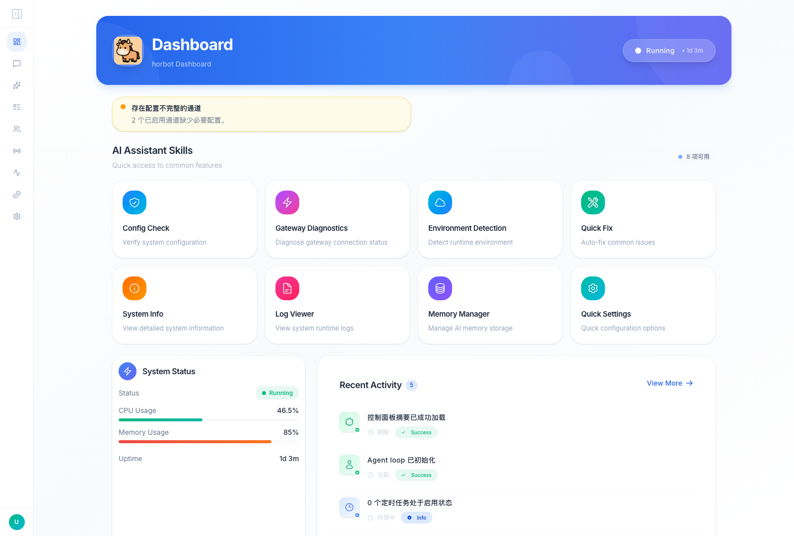
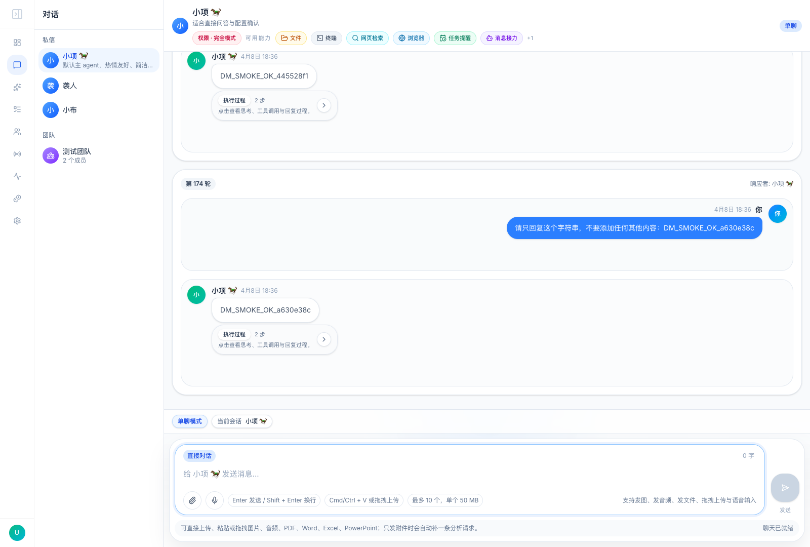
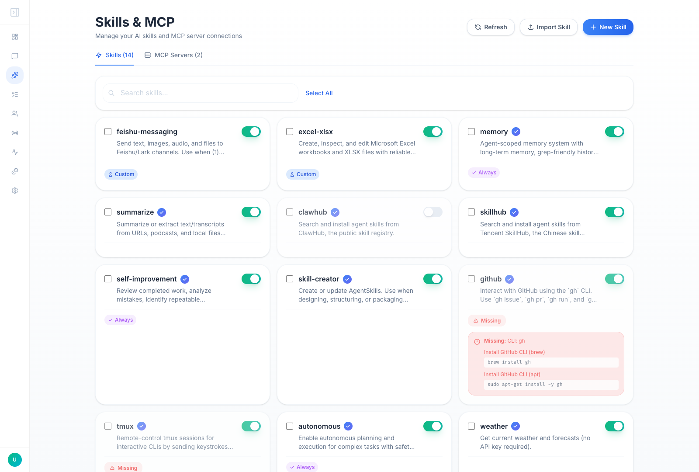
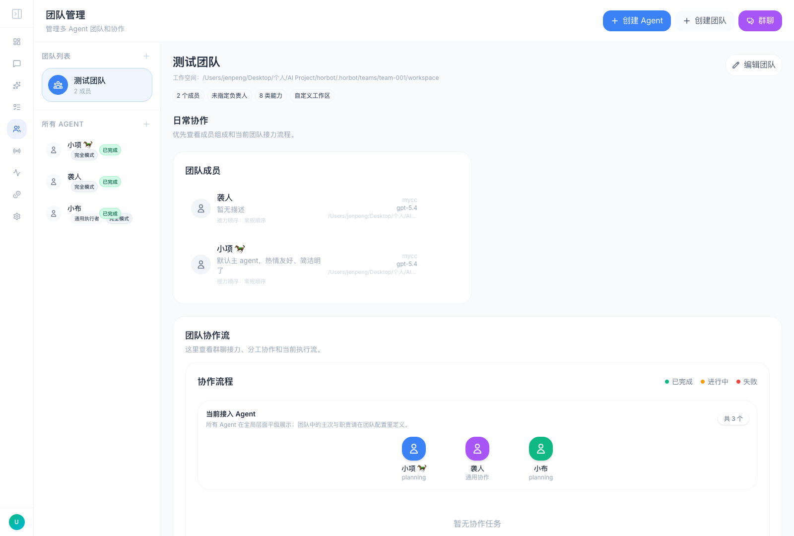

# Horbot

<div align="center">
  <h1>Horbot: A Lightweight Personal Multi-Agent Assistant</h1>
  <p>
    
    
  </p>
  <p>
    <a href="./README.md">English</a> |
    <a href="./docs/README_CN.md">简体中文</a>
  </p>
</div>

Horbot is a lightweight AI assistant stack focused on practical multi-agent orchestration, agent-specific workspaces, browser-based operations, chat channels, and persistent memory.

The project borrows and adapts ideas from several excellent open-source systems:

- Core lightweight agent patterns and implementation structure from [HKUDS/nanobot](https://github.com/HKUDS/nanobot)
- Autonomous agent and self-improvement ideas from [NousResearch/hermes-agent](https://github.com/NousResearch/hermes-agent)
- Three-layer memory ideas inspired by [volcengine/OpenViking](https://github.com/volcengine/OpenViking)
- Earlier skill-system inspiration from [OpenClaw](https://github.com/openclaw/openclaw)

Horbot does not attempt to be a giant framework. The emphasis is:

- a readable agent loop
- practical Web UI operations
- agent-scoped workspace, memory, sessions, and skills
- compatibility with real operational workflows

## Interface Preview

<table align="center">
  <tr align="center">
    <th>Dashboard</th>
    <th>Chat</th>
  </tr>
  <tr>
    <td align="center"></td>
    <td align="center"></td>
  </tr>
  <tr align="center">
    <th>Skills</th>
    <th>Teams</th>
  </tr>
  <tr>
    <td align="center"></td>
    <td align="center"></td>
  </tr>
</table>

## What Horbot Can Do

### Multi-Agent Operations

- Create multiple agents with independent `provider`, `model`, permission profile, workspace, memory, and skills
- Build teams with ordered members, responsibilities, and lead assignment
- Support direct chat and team relay conversations in the same UI
- Let agents silently review completed work and distill reusable workflows into skills

### Workspace And Memory

- Maintain per-agent `SOUL.md` and `USER.md`
- Persist agent-scoped memory under `.horbot/agents/<agent-id>/memory`
- Separate long-term memory, recent history, and reflection notes
- Keep team shared memory separate from private agent memory

### Chat And Attachments

- Markdown rendering for assistant messages
- Inline preview for image, audio, PDF, Office, and text attachments
- Drag-and-drop, paste upload, and retry flows
- Group chat history merge and recovery across legacy and current session paths

### Providers, Tools, And Channels

- Multiple provider backends
- MCP integration
- Browser and file-oriented tooling
- External channels such as WeCom, Feishu, ShareCRM, Telegram, Discord, Slack, Matrix, Email, Mochat, and others
- WeCom AI Bot support with reply-mode streaming, media upload, and inbound media download/decryption

### Operational Tooling

- Web admin UI for configuration, agents, teams, status, skills, channels, tasks, and token usage
- Smoke scripts for browser, chat, configuration, and agent asset flows
- Security defaults for local-only access and admin-token-gated remote access

## Quick Start

```bash
git clone https://github.com/jenpeng/horbot.git
cd horbot
./horbot.sh install
./horbot.sh start
```

Default local URLs:

- Web UI: [http://127.0.0.1:3000](http://127.0.0.1:3000)
- Backend API: [http://127.0.0.1:8000](http://127.0.0.1:8000)

Common commands:

```bash
./horbot.sh status
./horbot.sh restart
./horbot.sh logs backend
./horbot.sh smoke browser-e2e
```

## Documentation

### English

- [Documentation Index](./docs/README.md)
- [Architecture](./docs/ARCHITECTURE.md)
- [API](./docs/API.md)
- [User Manual](./docs/USER_MANUAL.md)
- [Multi-Agent Guide](./docs/MULTI_AGENT_GUIDE.md)
- [Skills](./docs/SKILLS.md)
- [Security](./docs/SECURITY.md)
- [Contributing](./docs/CONTRIBUTING.md)
- [Changelog](./CHANGELOG.md)

### Chinese

- [中文文档首页](./docs/README_CN.md)
- [架构说明](./docs/ARCHITECTURE_CN.md)
- [API 文档](./docs/API_CN.md)
- [用户手册](./docs/USER_MANUAL_CN.md)
- [多 Agent 操作手册](./docs/MULTI_AGENT_GUIDE_CN.md)
- [技能系统](./docs/SKILLS_CN.md)
- [安全指南](./docs/SECURITY_CN.md)
- [贡献指南](./docs/CONTRIBUTING_CN.md)
- [变更记录](./docs/CHANGELOG_CN.md)

## Current Runtime Layout

The current runtime model is agent-scoped:

```text
.horbot/
├── agents/
│   └── <agent-id>/
│       ├── workspace/
│       ├── memory/
│       ├── sessions/
│       └── skills/
├── teams/
│   └── <team-id>/
│       ├── workspace/
│       ├── shared_memory/
│       └── taskboard/
├── data/
│   ├── uploads/
│   ├── sessions/
│   ├── plans/
│   └── cron/
└── runtime/
    ├── logs/
    └── pids/
```

Legacy `.horbot/context` and `.horbot/memory` directories are no longer part of the active memory model and can be removed from existing local environments.

## Star History

[](https://star-history.com/#jenpeng/horbot&Date)
