# horbot 架构说明

本文档介绍 horbot 的整体架构和核心模块。

## 🏗️ 整体架构

horbot 采用模块化设计，核心组件包括：

1. **Agent 核心** - LLM 交互和工具执行
2. **渠道层** - 多平台消息接入
3. **提供商层** - 多 LLM 提供商支持
4. **工具系统** - 内置工具和 MCP 扩展
5. **存储层** - 会话、记忆、配置持久化

### 架构概览图

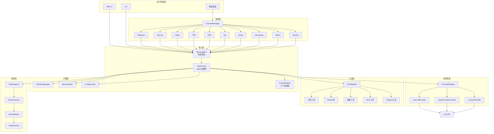
```mermaid
graph TB
    subgraph "用户界面层"
        WEB[Web UI]
        CLI[CLI]
        CHANNELS[聊天渠道]
    end

    subgraph "渠道层"
        CM[ChannelManager]
        TG[Telegram]
        DC[Discord]
        SL[Slack]
        FS[飞书]
        DT[钉钉]
        QQ[QQ]
        EM[Email]
        WA[WhatsApp]
        MX[Matrix]
        MC[Mochat]
    end

    subgraph "核心层"
        BUS[MessageBus<br/>消息总线]
        AGENT[AgentLoop<br/>Agent主循环]
        CTX[ContextBuilder<br/>上下文构建]
    end

    subgraph "提供商层"
        REGISTRY[ProviderRegistry]
        LITELLM[LiteLLMProvider]
        CODEX[OpenAICodexProvider]
        CUSTOM[CustomProvider]
    end

    subgraph "工具层"
        TOOLS[ToolRegistry]
        FS_TOOL[文件工具]
        SHELL[Shell工具]
        WEB_TOOL[网络工具]
        MCP[MCP工具]
        SPAWN[子Agent工具]
    end

    subgraph "存储层"
        SESSION[SessionManager]
        MEMORY[MemoryStore]
        CONFIG[ConfigLoader]
    end

    subgraph "规划层"
        ANALYZER[TaskAnalyzer]
        GENERATOR[PlanGenerator]
        VALIDATOR[PlanValidator]
        EXECUTOR[PlanExecutor]
    end

    WEB --> BUS
    CLI --> BUS
    CHANNELS --> CM
    CM --> TG & DC & SL & FS & DT & QQ & EM & WA & MX & MC
    TG & DC & SL & FS & DT & QQ & EM & WA & MX & MC --> BUS

    BUS --> AGENT
    AGENT --> CTX
    AGENT --> REGISTRY
    REGISTRY --> LITELLM & CODEX & CUSTOM
    LITELLM & CODEX & CUSTOM --> LLM[LLM API]

    AGENT --> TOOLS
    TOOLS --> FS_TOOL & SHELL & WEB_TOOL & MCP & SPAWN

    AGENT --> SESSION
    AGENT --> MEMORY
    AGENT --> CONFIG

    AGENT --> ANALYZER
    ANALYZER --> GENERATOR
    GENERATOR --> VALIDATOR
    VALIDATOR --> EXECUTOR
```

***

## 📁 目录结构

```
horbot/
├── __main__.py              # 入口点
├── agent/                   # Agent 核心模块
│   ├── loop.py              # Agent 主循环
│   ├── context.py           # 上下文构建器
│   ├── memory.py            # 记忆存储
│   ├── skills.py            # 技能加载器
│   ├── subagent.py          # 子 Agent 管理
│   ├── planner.py           # 规划器入口
│   ├── planner/             # 规划模块
│   │   ├── analyzer.py      # 任务复杂度分析
│   │   ├── generator.py     # 计划生成
│   │   ├── validator.py     # 计划验证
│   │   ├── storage.py       # 计划存储
│   │   └── models.py        # 数据模型
│   ├── executor/            # 执行模块
│   │   ├── checkpoint.py    # 检查点管理
│   │   └── state.py         # 状态管理
│   ├── tools/               # 工具模块
│   │   ├── base.py          # 工具基类
│   │   ├── registry.py      # 工具注册表
│   │   ├── permission.py    # 权限管理
│   │   ├── filesystem.py    # 文件操作
│   │   ├── safe_editor.py   # 安全编辑
│   │   ├── shell.py         # Shell 执行
│   │   ├── web.py           # 网络搜索
│   │   ├── message.py       # 消息发送
│   │   ├── spawn.py         # 子 Agent
│   │   ├── cron.py          # 定时任务
│   │   └── mcp.py           # MCP 工具
│   ├── audit/               # 审计模块
│   ├── sandbox/             # 沙箱模块
│   └── workflow/            # 工作流模块
├── bus/                     # 消息总线
│   ├── events.py            # 事件定义
│   └── queue.py             # 消息队列
├── channels/                # 渠道模块
│   ├── base.py              # 基础渠道
│   ├── manager.py           # 渠道管理器
│   ├── telegram.py          # Telegram
│   ├── discord.py           # Discord
│   ├── slack.py             # Slack
│   ├── feishu.py            # 飞书
│   ├── dingtalk.py          # 钉钉
│   ├── qq.py                # QQ
│   ├── email.py             # 邮件
│   ├── whatsapp.py          # WhatsApp
│   ├── matrix.py            # Matrix
│   └── mochat.py            # Mochat
├── cli/                     # 命令行接口
│   └── commands.py          # CLI 命令
├── config/                  # 配置模块
│   ├── schema.py            # 配置模式
│   └── loader.py            # 配置加载器
├── cron/                    # 定时任务
│   ├── service.py           # 任务服务
│   └── types.py             # 类型定义
├── heartbeat/               # 心跳服务
│   └── service.py           # 心跳服务
├── providers/               # LLM 提供商
│   ├── base.py              # 基础提供商
│   ├── registry.py          # 提供商注册表
│   ├── litellm_provider.py  # LiteLLM 集成
│   ├── openai_codex_provider.py  # OpenAI Codex
│   ├── custom_provider.py   # 自定义提供商
│   └── transcription.py     # 语音转录
├── session/                 # 会话管理
│   └── manager.py           # 会话管理器
├── skills/                  # 内置技能
│   ├── autonomous/          # 自主执行技能
│   ├── clawhub/             # ClawHub 技能
│   ├── cron/                # 定时任务技能
│   ├── github/              # GitHub 技能
│   ├── memory/              # 记忆技能
│   ├── skill-creator/       # 技能创建器
│   ├── summarize/           # 总结技能
│   ├── tmux/                # Tmux 技能
│   └── weather/             # 天气技能
├── templates/               # 模板文件
│   ├── AGENTS.md            # Agent 系统提示词
│   ├── SOUL.md              # Agent 人格
│   ├── USER.md              # 用户档案
│   ├── TOOLS.md             # 工具说明
│   └── HEARTBEAT.md         # 心跳模板
├── utils/                   # 工具函数
│   └── helpers.py           # 辅助函数
└── web/                     # Web 界面
    ├── main.py              # FastAPI 入口
    ├── api.py               # API 路由
    ├── websocket.py         # WebSocket 处理
    └── frontend/            # 前端代码
```

***

## 📦 核心模块详解

### 1. Agent 模块 (`horbot/agent/`)

Agent 是 horbot 的核心，负责与 LLM 交互和工具执行。

#### 模块依赖关系

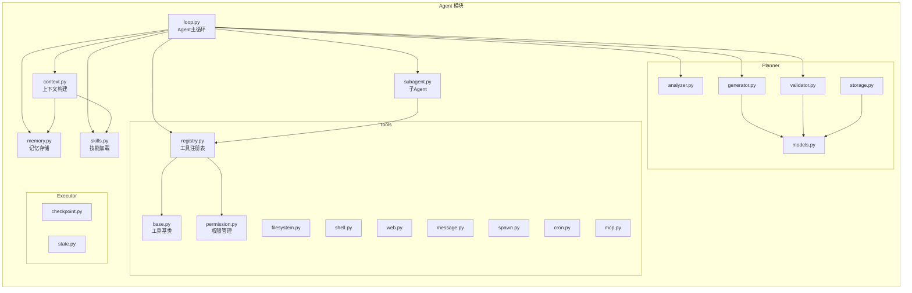
```mermaid
graph LR
    subgraph "Agent 模块"
        LOOP[loop.py<br/>Agent主循环]
        CTX[context.py<br/>上下文构建]
        MEM[memory.py<br/>记忆存储]
        SKL[skills.py<br/>技能加载]
        SUB[subagent.py<br/>子Agent]
        
        subgraph "Tools"
            REG[registry.py<br/>工具注册表]
            BASE[base.py<br/>工具基类]
            PERM[permission.py<br/>权限管理]
            FS[filesystem.py]
            SH[shell.py]
            WEB[web.py]
            MSG[message.py]
            SPN[spawn.py]
            CRON[cron.py]
            MCP[mcp.py]
        end
        
        subgraph "Planner"
            ANA[analyzer.py]
            GEN[generator.py]
            VAL[validator.py]
            STO[storage.py]
            MOD[models.py]
        end
        
        subgraph "Executor"
            CHK[checkpoint.py]
            STA[state.py]
        end
    end
    
    LOOP --> CTX
    LOOP --> MEM
    LOOP --> SKL
    LOOP --> SUB
    LOOP --> REG
    LOOP --> ANA
    LOOP --> GEN
    LOOP --> VAL
    
    CTX --> MEM
    CTX --> SKL
    
    REG --> BASE
    REG --> PERM
    
    SUB --> REG
    
    GEN --> MOD
    VAL --> MOD
    STO --> MOD
```

#### AgentLoop 核心流程

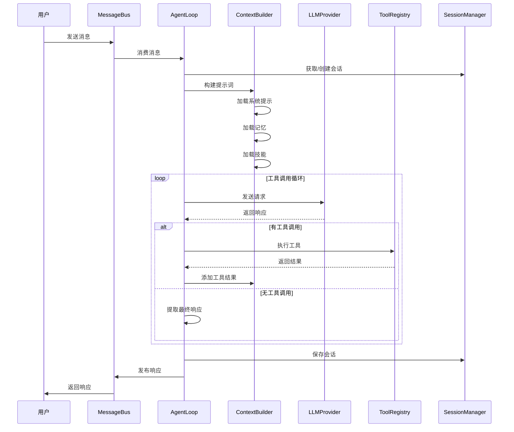
```mermaid
sequenceDiagram
    participant User as 用户
    participant Bus as MessageBus
    participant Agent as AgentLoop
    participant Context as ContextBuilder
    participant LLM as LLMProvider
    participant Tools as ToolRegistry
    participant Session as SessionManager

    User->>Bus: 发送消息
    Bus->>Agent: 消费消息
    Agent->>Session: 获取/创建会话
    Agent->>Context: 构建提示词
    Context->>Context: 加载系统提示
    Context->>Context: 加载记忆
    Context->>Context: 加载技能
    
    loop 工具调用循环
        Agent->>LLM: 发送请求
        LLM-->>Agent: 返回响应
        
        alt 有工具调用
            Agent->>Tools: 执行工具
            Tools-->>Agent: 返回结果
            Agent->>Context: 添加工具结果
        else 无工具调用
            Agent->>Agent: 提取最终响应
        end
    end
    
    Agent->>Session: 保存会话
    Agent->>Bus: 发布响应
    Bus->>User: 返回响应
```

#### 核心类说明

| 类名                           | 文件                      | 职责                         |
| ---------------------------- | ----------------------- | -------------------------- |
| `AgentLoop`                  | loop.py                 | Agent 主循环，处理消息、调用 LLM、执行工具 |
| `ContextBuilder`             | context.py              | 构建系统提示词和消息上下文              |
| `MemoryStore`                | memory.py               | 管理长期记忆和历史记录                |
| `SkillsLoader`               | skills.py               | 加载和管理技能                    |
| `SubagentManager`            | subagent.py             | 管理后台子 Agent 任务             |
| `ToolRegistry`               | tools/registry.py       | 工具注册和执行管理                  |
| `PermissionManager`          | tools/permission.py     | 工具权限控制                     |
| `HierarchicalContextManager` | context\_manager.py     | 分层上下文管理 (L0/L1/L2)         |
| `PlanExecutor`               | plan\_executor.py       | 计划执行器                      |
| `PlanStepSubagent`           | plan\_step\_subagent.py | 计划步骤子代理                    |

***

### 2. 分层上下文管理 (`horbot/agent/context_manager.py`)

分层上下文管理器实现了三层记忆架构：

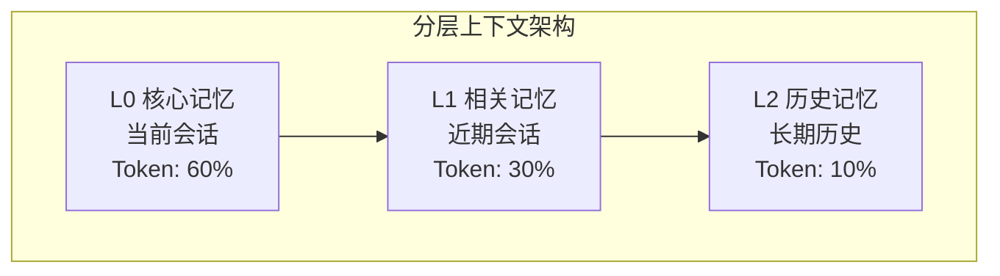
```mermaid
graph TB
    subgraph "分层上下文架构"
        L0[L0 核心记忆<br/>当前会话<br/>Token: 60%]
        L1[L1 相关记忆<br/>近期会话<br/>Token: 30%]
        L2[L2 历史记忆<br/>长期历史<br/>Token: 10%]
        
        L0 --> L1
        L1 --> L2
    end
```

**层级说明**：

| 层级     | 名称   | 用途             | 加载策略     | Token 预算 |
| ------ | ---- | -------------- | -------- | -------- |
| **L0** | 核心记忆 | 当前会话的核心记忆，始终加载 | 按会话标识加载  | 60%      |
| **L1** | 相关记忆 | 近期会话的相关记忆，按需加载 | 按修改时间排序  | 30%      |
| **L2** | 历史记忆 | 长期历史记忆，检索加载    | 通过搜索查询检索 | 10%      |

**主要功能**：

- `load_context()`: 加载分层上下文
- `add_memory()`: 添加记忆到指定层级
- `search_context()`: 搜索上下文内容
- `add_execution()`: 添加执行日志

***

### 3. 配置模块 (`horbot/config/`)

#### 配置加载流程

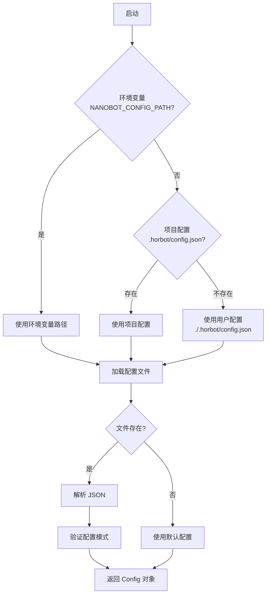
```mermaid
flowchart TD
    A[启动] --> B{环境变量<br/>NANOBOT_CONFIG_PATH?}
    B -->|是| C[使用环境变量路径]
    B -->|否| D{项目配置<br/>.horbot/config.json?}
    D -->|存在| E[使用项目配置]
    D -->|不存在| F[使用用户配置<br/>./.horbot/config.json]
    C --> G[加载配置文件]
    E --> G
    F --> G
    G --> H{文件存在?}
    H -->|是| I[解析 JSON]
    H -->|否| J[使用默认配置]
    I --> K[验证配置模式]
    K --> L[返回 Config 对象]
    J --> L
```

#### 配置热加载 (ConfigWatcher)

位置：`horbot/config/watcher.py`

配置文件热加载监控器：

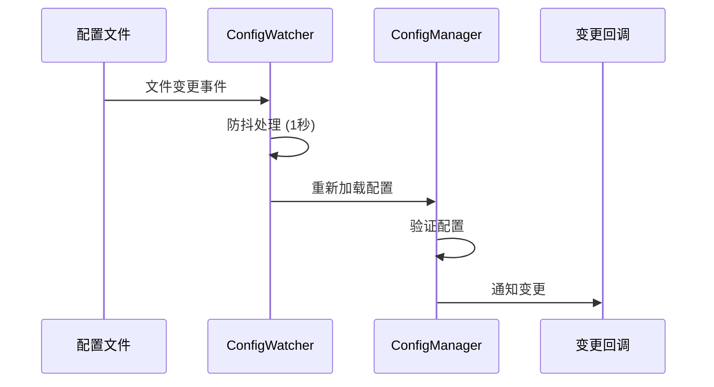
```mermaid
sequenceDiagram
    participant File as 配置文件
    participant Watcher as ConfigWatcher
    participant Manager as ConfigManager
    participant Callback as 变更回调

    File->>Watcher: 文件变更事件
    Watcher->>Watcher: 防抖处理 (1秒)
    Watcher->>Manager: 重新加载配置
    Manager->>Manager: 验证配置
    Manager->>Callback: 通知变更
```

**主要功能**：

- 使用 watchfiles 库监控配置文件变化
- 防抖机制避免频繁重载（默认 1 秒）
- 自动通知配置变更回调

**自动应用的配置项**：

- `agents.defaults.max_iterations`
- `agents.defaults.temperature`
- `agents.defaults.max_tokens`
- `tools.permission.*`
- `tools.mcpServers.*`

#### 配置层次结构

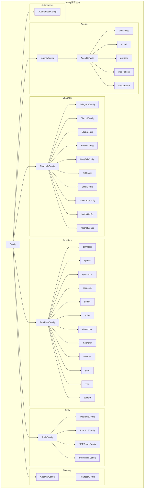
```mermaid
graph TB
    subgraph "Config 配置结构"
        CONFIG[Config]
        
        subgraph "Agents"
            AGENTS[AgentsConfig]
            DEFAULTS[AgentDefaults]
            DEFAULTS --> WORKSPACE[workspace]
            DEFAULTS --> MODEL[model]
            DEFAULTS --> PROVIDER[provider]
            DEFAULTS --> MAX_TOKENS[max_tokens]
            DEFAULTS --> TEMPERATURE[temperature]
        end
        
        subgraph "Channels"
            CHANNELS[ChannelsConfig]
            TG[TelegramConfig]
            DC[DiscordConfig]
            SL[SlackConfig]
            FS[FeishuConfig]
            DT[DingTalkConfig]
            QQ[QQConfig]
            EM[EmailConfig]
            WA[WhatsAppConfig]
            MX[MatrixConfig]
            MC[MochatConfig]
        end
        
        subgraph "Providers"
            PROVIDERS[ProvidersConfig]
            ANTHROPIC[anthropic]
            OPENAI[openai]
            OPENROUTER[openrouter]
            DEEPSEEK[deepseek]
            GEMINI[gemini]
            ZHIPU[zhipu]
            DASHSCOPE[dashscope]
            MOONSHOT[moonshot]
            MINIMAX[minimax]
            GROQ[groq]
            VLLM[vllm]
            CUSTOM[custom]
        end
        
        subgraph "Tools"
            TOOLS[ToolsConfig]
            WEB_TOOLS[WebToolsConfig]
            EXEC_TOOL[ExecToolConfig]
            MCP_SERVERS[MCPServerConfig]
            PERMISSION[PermissionConfig]
        end
        
        subgraph "Gateway"
            GATEWAY[GatewayConfig]
            HEARTBEAT[HeartbeatConfig]
        end
        
        subgraph "Autonomous"
            AUTONOMOUS[AutonomousConfig]
        end
        
        CONFIG --> AGENTS
        CONFIG --> CHANNELS
        CONFIG --> PROVIDERS
        CONFIG --> TOOLS
        CONFIG --> GATEWAY
        CONFIG --> AUTONOMOUS
        
        AGENTS --> DEFAULTS
        CHANNELS --> TG & DC & SL & FS & DT & QQ & EM & WA & MX & MC
        PROVIDERS --> ANTHROPIC & OPENAI & OPENROUTER & DEEPSEEK & GEMINI & ZHIPU & DASHSCOPE & MOONSHOT & MINIMAX & GROQ & VLLM & CUSTOM
        TOOLS --> WEB_TOOLS & EXEC_TOOL & MCP_SERVERS & PERMISSION
        GATEWAY --> HEARTBEAT
    end
```

***

### 3. 渠道模块 (`horbot/channels/`)

渠道模块负责与各聊天平台的集成。

#### 渠道管理流程

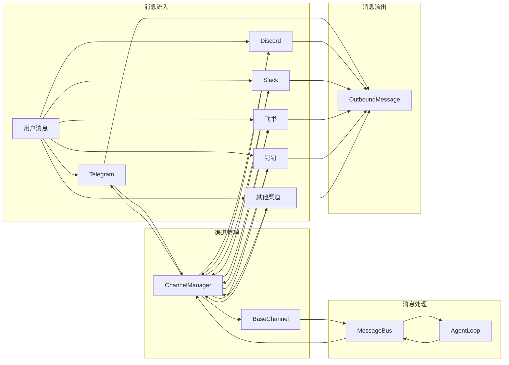
```mermaid
flowchart LR
    subgraph "消息流入"
        USER[用户消息]
        TG[Telegram]
        DC[Discord]
        SL[Slack]
        FS[飞书]
        DT[钉钉]
        OTHER[其他渠道...]
    end
    
    subgraph "渠道管理"
        CM[ChannelManager]
        BASE[BaseChannel]
    end
    
    subgraph "消息处理"
        BUS[MessageBus]
        AGENT[AgentLoop]
    end
    
    subgraph "消息流出"
        OUT[OutboundMessage]
    end
    
    USER --> TG & DC & SL & FS & DT & OTHER
    TG & DC & SL & FS & DT & OTHER --> CM
    CM --> BASE
    BASE --> BUS
    BUS --> AGENT
    AGENT --> BUS
    BUS --> CM
    CM --> TG & DC & SL & FS & DT & OTHER
    TG & DC & SL & FS & DT & OTHER --> OUT
```

#### BaseChannel 接口

```python
class BaseChannel(ABC):
    name: str = "base"
    
    @abstractmethod
    async def start(self) -> None:
        """启动渠道，开始监听消息"""
        pass
    
    @abstractmethod
    async def stop(self) -> None:
        """停止渠道，清理资源"""
        pass
    
    @abstractmethod
    async def send(self, msg: OutboundMessage) -> None:
        """发送消息到渠道"""
        pass
    
    def is_allowed(self, sender_id: str) -> bool:
        """检查发送者是否有权限"""
        pass
```

#### 支持的渠道

| 渠道       | 文件          | 特性                    |
| -------- | ----------- | --------------------- |
| Telegram | telegram.py | 支持 Markdown、媒体消息、语音转录 |
| Discord  | discord.py  | 支持 Gateway 连接、频道消息    |
| Slack    | slack.py    | 支持 Socket Mode、线程回复   |
| 飞书       | feishu.py   | 支持 WebSocket 长连接      |
| 钉钉       | dingtalk.py | 支持 Stream 模式          |
| QQ       | qq.py       | 支持 botpy SDK          |
| Email    | email.py    | 支持 IMAP 接收、SMTP 发送    |
| WhatsApp | whatsapp.py | 支持桥接模式                |
| Matrix   | matrix.py   | 支持端到端加密               |
| Mochat   | mochat.py   | 支持群组消息                |

***

### 4. Provider 模块 (`horbot/providers/`)

提供商模块负责与各 LLM 提供商的集成。

#### 提供商选择流程

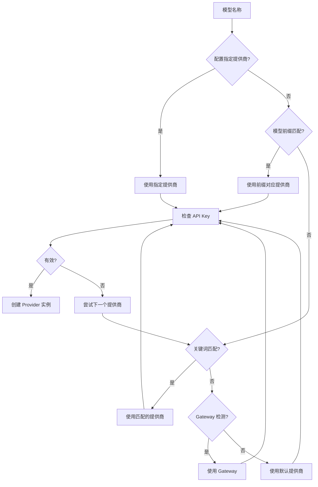
```mermaid
flowchart TD
    A[模型名称] --> B{配置指定提供商?}
    B -->|是| C[使用指定提供商]
    B -->|否| D{模型前缀匹配?}
    D -->|是| E[使用前缀对应提供商]
    D -->|否| F{关键词匹配?}
    F -->|是| G[使用匹配的提供商]
    F -->|否| H{Gateway 检测?}
    H -->|是| I[使用 Gateway]
    H -->|否| J[使用默认提供商]
    
    C --> K[检查 API Key]
    E --> K
    G --> K
    I --> K
    J --> K
    
    K --> L{有效?}
    L -->|是| M[创建 Provider 实例]
    L -->|否| N[尝试下一个提供商]
    N --> F
```

#### 提供商类型

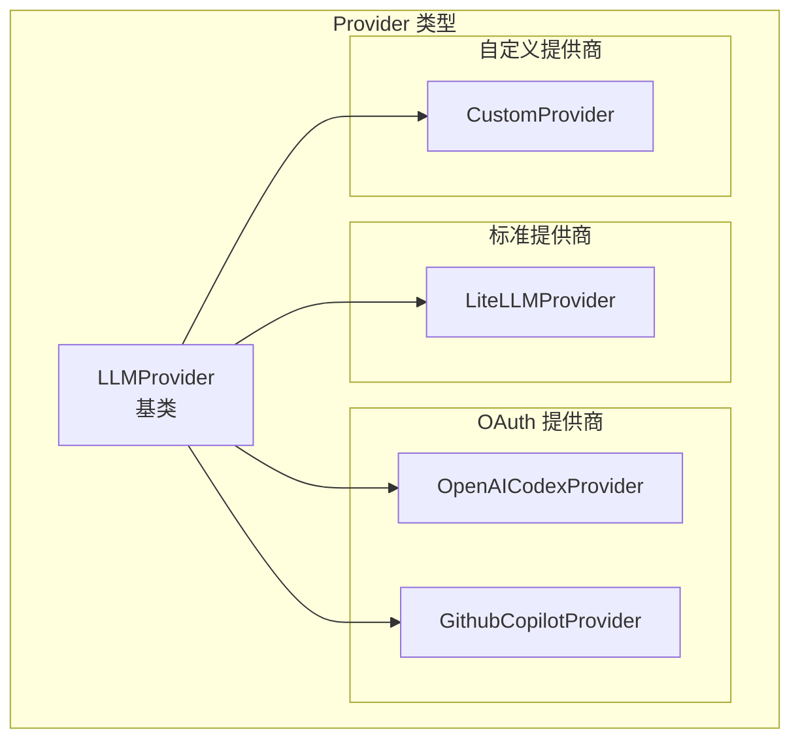
```mermaid
graph TB
    subgraph "Provider 类型"
        BASE[LLMProvider<br/>基类]
        
        subgraph "标准提供商"
            LITELLM[LiteLLMProvider]
        end
        
        subgraph "OAuth 提供商"
            CODEX[OpenAICodexProvider]
            COPILOT[GithubCopilotProvider]
        end
        
        subgraph "自定义提供商"
            CUSTOM[CustomProvider]
        end
    end
    
    BASE --> LITELLM
    BASE --> CODEX
    BASE --> COPILOT
    BASE --> CUSTOM
```

#### 支持的提供商

| 提供商            | 关键词               | 特性            |
| -------------- | ----------------- | ------------- |
| Anthropic      | claude, anthropic | 支持提示缓存        |
| OpenAI         | gpt, openai       | 标准支持          |
| OpenRouter     | openrouter        | Gateway，支持多模型 |
| DeepSeek       | deepseek          | 支持 R1 推理      |
| Gemini         | gemini            | Google AI     |
| Zhipu          | zhipu, glm        | 智谱 AI         |
| DashScope      | qwen, dashscope   | 阿里云通义千问       |
| Moonshot       | moonshot, kimi    | Moonshot AI   |
| MiniMax        | minimax           | MiniMax AI    |
| Groq           | groq              | 高速推理          |
| vLLM           | vllm              | 本地部署          |
| OpenAI Codex   | codex             | OAuth 认证      |
| GitHub Copilot | copilot           | OAuth 认证      |

***

### 5. 工具模块 (`horbot/agent/tools/`)

#### 工具执行流程

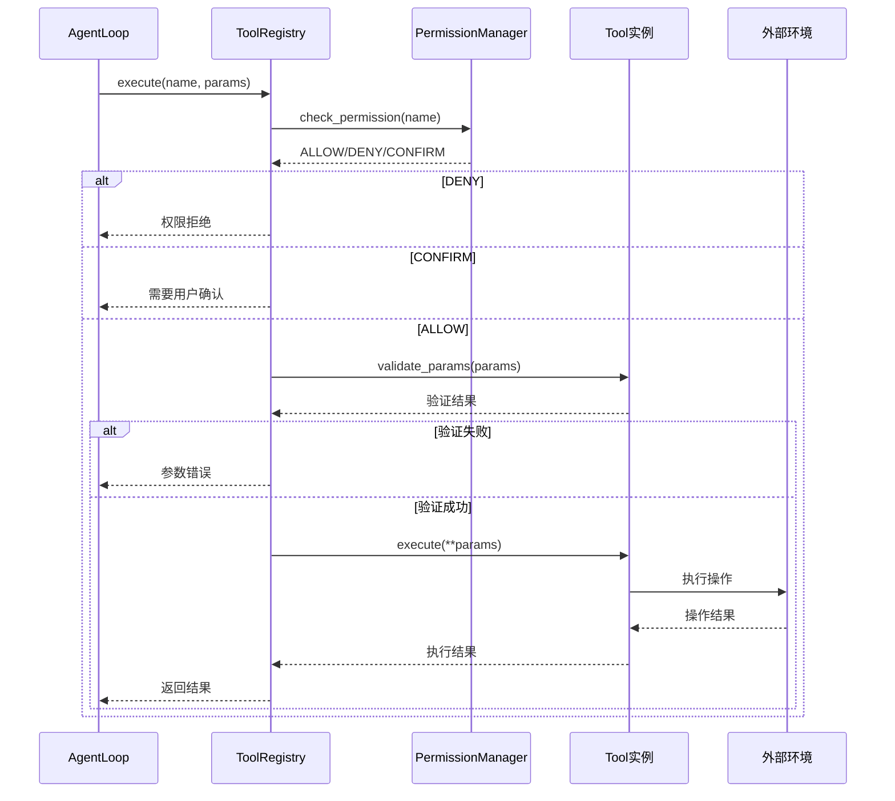
```mermaid
sequenceDiagram
    participant Agent as AgentLoop
    participant Registry as ToolRegistry
    participant Perm as PermissionManager
    participant Tool as Tool实例
    participant Env as 外部环境

    Agent->>Registry: execute(name, params)
    Registry->>Perm: check_permission(name)
    Perm-->>Registry: ALLOW/DENY/CONFIRM
    
    alt DENY
        Registry-->>Agent: 权限拒绝
    else CONFIRM
        Registry-->>Agent: 需要用户确认
    else ALLOW
        Registry->>Tool: validate_params(params)
        Tool-->>Registry: 验证结果
        
        alt 验证失败
            Registry-->>Agent: 参数错误
        else 验证成功
            Registry->>Tool: execute(**params)
            Tool->>Env: 执行操作
            Env-->>Tool: 操作结果
            Tool-->>Registry: 执行结果
            Registry-->>Agent: 返回结果
        end
    end
```

#### 工具基类

```python
class Tool(ABC):
    @property
    @abstractmethod
    def name(self) -> str:
        """工具名称"""
        pass
    
    @property
    @abstractmethod
    def description(self) -> str:
        """工具描述"""
        pass
    
    @property
    @abstractmethod
    def parameters(self) -> dict[str, Any]:
        """参数 JSON Schema"""
        pass
    
    @abstractmethod
    async def execute(self, **kwargs: Any) -> str:
        """执行工具"""
        pass
    
    def to_schema(self) -> dict[str, Any]:
        """转换为 OpenAI 函数格式"""
        pass
```

#### 内置工具

| 工具           | 文件              | 功能          |
| ------------ | --------------- | ----------- |
| `read_file`  | filesystem.py   | 读取文件内容      |
| `write_file` | safe\_editor.py | 安全写入文件      |
| `edit_file`  | safe\_editor.py | 安全编辑文件      |
| `list_dir`   | filesystem.py   | 列出目录内容      |
| `exec`       | shell.py        | 执行 Shell 命令 |
| `web_search` | web.py          | 网络搜索        |
| `web_fetch`  | web.py          | 获取网页内容      |
| `message`    | message.py      | 发送消息到渠道     |
| `spawn`      | spawn.py        | 启动子 Agent   |
| `cron`       | cron.py         | 管理定时任务      |

***

### 6. 消息总线 (`horbot/bus/`)

#### 消息流

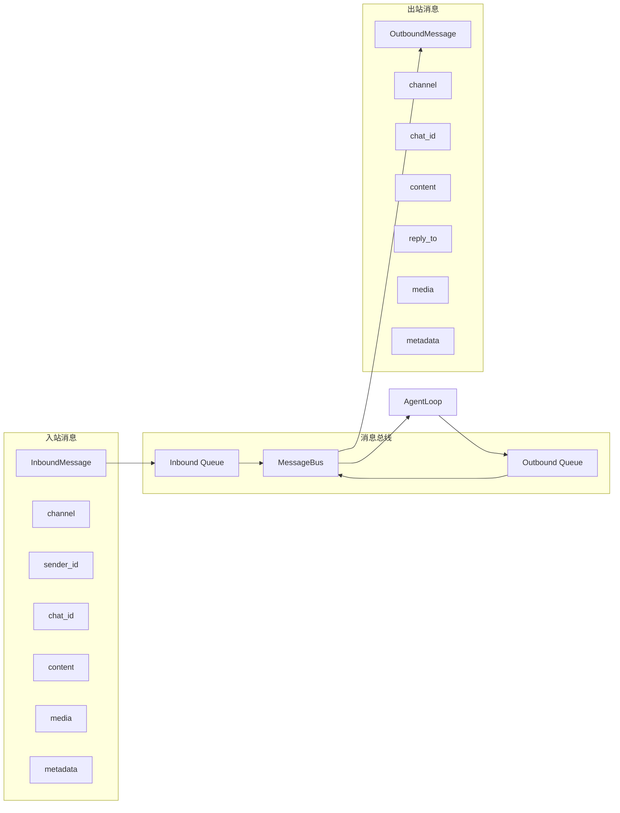
```mermaid
flowchart LR
    subgraph "入站消息"
        IN[InboundMessage]
        IN_CH[channel]
        IN_SENDER[sender_id]
        IN_CHAT[chat_id]
        IN_CONTENT[content]
        IN_MEDIA[media]
        IN_META[metadata]
    end
    
    subgraph "消息总线"
        BUS[MessageBus]
        IN_Q[Inbound Queue]
        OUT_Q[Outbound Queue]
    end
    
    subgraph "出站消息"
        OUT[OutboundMessage]
        OUT_CH[channel]
        OUT_CHAT[chat_id]
        OUT_CONTENT[content]
        OUT_REPLY[reply_to]
        OUT_MEDIA[media]
        OUT_META[metadata]
    end
    
    IN --> IN_Q
    IN_Q --> BUS
    BUS --> AGENT[AgentLoop]
    AGENT --> OUT_Q
    OUT_Q --> BUS
    BUS --> OUT
```

#### 数据结构

```python
@dataclass
class InboundMessage:
    channel: str              # 渠道名称
    sender_id: str            # 发送者 ID
    chat_id: str              # 聊天 ID
    content: str              # 消息内容
    timestamp: datetime       # 时间戳
    media: list[str]          # 媒体 URL
    metadata: dict[str, Any]  # 元数据
    session_key_override: str | None  # 会话键覆盖

@dataclass
class OutboundMessage:
    channel: str              # 渠道名称
    chat_id: str              # 聊天 ID
    content: str              # 消息内容
    reply_to: str | None      # 回复消息 ID
    media: list[str]          # 媒体 URL
    metadata: dict[str, Any]  # 元数据
```

***

### 7. 会话管理 (`horbot/session/`)

#### 会话生命周期

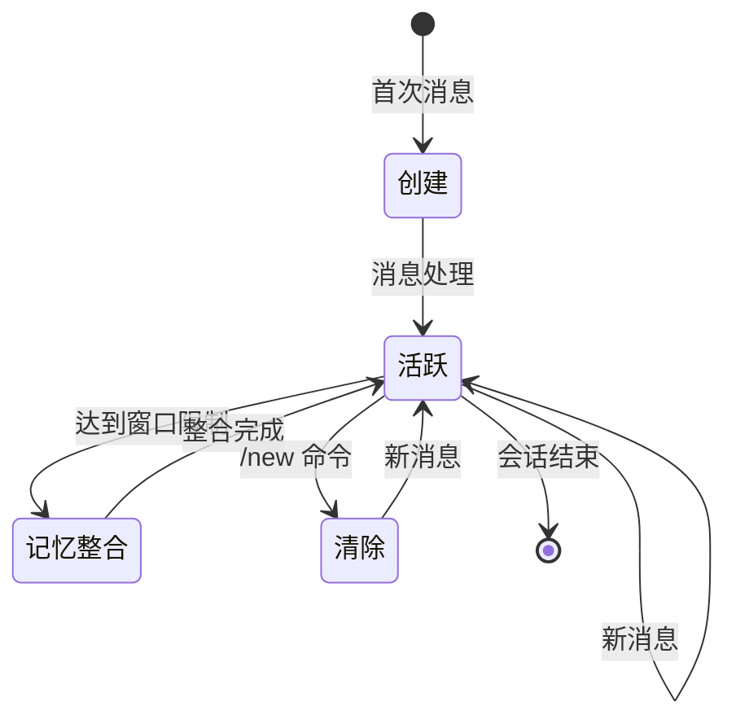
```mermaid
stateDiagram-v2
    [*] --> 创建: 首次消息
    创建 --> 活跃: 消息处理
    活跃 --> 活跃: 新消息
    活跃 --> 记忆整合: 达到窗口限制
    记忆整合 --> 活跃: 整合完成
    活跃 --> 清除: /new 命令
    清除 --> 活跃: 新消息
    活跃 --> [*]: 会话结束
```

#### Session 数据结构

```python
@dataclass
class Session:
    key: str                    # 会话键 (channel:chat_id)
    messages: list[dict]        # 消息历史
    created_at: datetime        # 创建时间
    updated_at: datetime        # 更新时间
    metadata: dict[str, Any]    # 元数据
    last_consolidated: int      # 上次整合位置
    title: str                  # 会话标题
    _pending_confirmations: dict  # 待确认操作
```

***

### 8. 规划模块 (`horbot/agent/planner/`)

> 当前规划链路由系统自动触发。`agents.defaults.models.planning` 仍表示内部规划场景模型，但 Web Chat 中不再提供 `/plan` 这类显式命令入口。

#### 规划流程

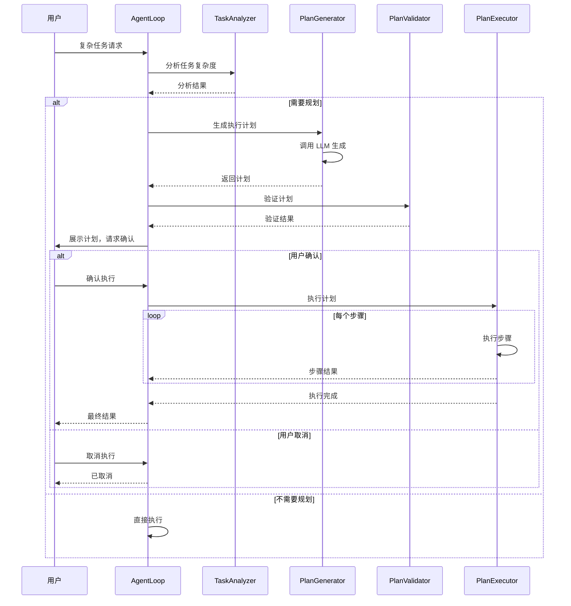
```mermaid
sequenceDiagram
    participant User as 用户
    participant Agent as AgentLoop
    participant Analyzer as TaskAnalyzer
    participant Generator as PlanGenerator
    participant Validator as PlanValidator
    participant Executor as PlanExecutor

    User->>Agent: 复杂任务请求
    Agent->>Analyzer: 分析任务复杂度
    Analyzer-->>Agent: 分析结果
    
    alt 需要规划
        Agent->>Generator: 生成执行计划
        Generator->>Generator: 调用 LLM 生成
        Generator-->>Agent: 返回计划
        Agent->>Validator: 验证计划
        Validator-->>Agent: 验证结果
        Agent->>User: 展示计划，请求确认
        
        alt 用户确认
            User->>Agent: 确认执行
            Agent->>Executor: 执行计划
            loop 每个步骤
                Executor->>Executor: 执行步骤
                Executor-->>Agent: 步骤结果
            end
            Executor-->>Agent: 执行完成
            Agent-->>User: 最终结果
        else 用户取消
            User->>Agent: 取消执行
            Agent-->>User: 已取消
        end
    else 不需要规划
        Agent->>Agent: 直接执行
    end
```

#### 任务复杂度分析

| 级别       | 分数范围 | 特征         | 处理方式 |
| -------- | ---- | ---------- | ---- |
| SIMPLE   | 0-2  | 单步操作、明确指令  | 直接执行 |
| MODERATE | 3-5  | 多步操作、需要推理  | 可选规划 |
| COMPLEX  | 6-8  | 多文件修改、依赖关系 | 建议规划 |
| CRITICAL | 9+   | 系统级操作、高风险  | 强制规划 |

***

## 🔒 安全架构

### 权限系统

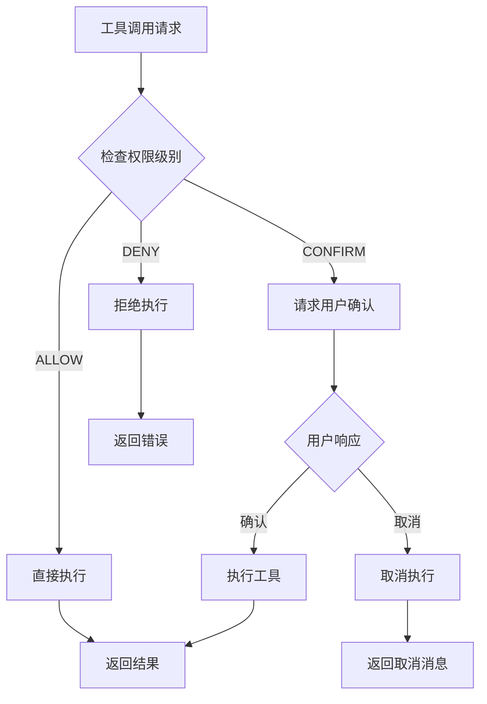
```mermaid
flowchart TD
    A[工具调用请求] --> B{检查权限级别}
    
    B -->|ALLOW| C[直接执行]
    B -->|DENY| D[拒绝执行]
    B -->|CONFIRM| E[请求用户确认]
    
    E --> F{用户响应}
    F -->|确认| G[执行工具]
    F -->|取消| H[取消执行]
    
    C --> I[返回结果]
    G --> I
    D --> J[返回错误]
    H --> K[返回取消消息]
```

### 权限配置

```json
{
  "tools": {
    "permission": {
      "profile": "balanced",
      "allow": ["read_file", "list_dir", "web_search"],
      "deny": ["exec:rm -rf"],
      "confirm": ["exec", "write_file", "edit_file"]
    }
  }
}
```

### 路径保护

| 路径模式             | 保护级别 |
| ---------------- | ---- |
| `~/.ssh`         | 完全保护 |
| `~/.env`         | 完全保护 |
| `**/config.json` | 完全保护 |
| `**/.env`        | 完全保护 |
| 工作区内             | 允许操作 |
| 工作区外             | 根据配置 |

***

## 📂 存储架构

### 工作区目录结构

```
workspace/
├── .audit/              # 审计日志
│   └── audit.jsonl      # 操作记录
├── .checkpoints/        # 执行检查点
│   └── {plan_id}.json   # 计划状态
├── .state/              # 运行时状态
│   └── state.json       # 全局状态
├── memory/              # 长期记忆
│   ├── MEMORY.md        # 用户事实
│   └── HISTORY.md       # 事件日志
├── sessions/            # 会话历史
│   └── {session_key}.jsonl
├── skills/              # 自定义技能
│   └── {skill_name}/
│       └── SKILL.md
├── cron/                # 定时任务
│   └── store.json       # 任务存储
├── plans/               # 执行计划
│   ├── index.json       # 计划索引
│   └── {plan_id}/       # 计划详情
│       ├── spec.md
│       ├── tasks.md
│       └── checklist.md
├── logs/                # 日志文件
│   ├── gateway.log
│   └── web.log
├── AGENTS.md            # Agent 系统提示词
├── SOUL.md              # Agent 人格
├── USER.md              # 用户档案
└── TOOLS.md             # 工具说明
```

***

## 🔌 扩展机制

### 技能系统

技能是扩展 Agent 能力的方式，通过 Markdown 文件定义：

```markdown
---
name: weather
description: 获取天气信息
always: false
enabled: true
requires:
  bins: []
  env: ["WEATHER_API_KEY"]
---

# 天气技能

## 使用方法
当用户询问天气时，使用此技能获取天气信息...

## 示例
用户: 北京今天天气怎么样？
助手: [调用天气 API 获取信息]
```

### MCP 集成

MCP (Model Context Protocol) 允许连接外部工具服务器：

```json
{
  "tools": {
    "mcpServers": {
      "filesystem": {
        "command": "npx",
        "args": ["-y", "@modelcontextprotocol/server-filesystem", "/path/to/dir"],
        "env": {},
        "tool_timeout": 30
      },
      "http-server": {
        "url": "https://mcp.example.com/sse",
        "headers": {
          "Authorization": "Bearer token"
        }
      }
    }
  }
}
```

***

## 🚀 性能优化

### 提示缓存

- 支持 Anthropic 提示缓存
- 自动缓存系统提示词
- 减少重复 token 消耗

### 并发处理

- 异步 I/O（asyncio）
- 并发工具执行
- 流式响应支持

### 资源管理

- 会话窗口限制（memory\_window）
- 自动记忆整合
- 日志轮转

***

## 📡 API 接口

### Web API 端点

| 端点                       | 方法                  | 描述         |
| ------------------------ | ------------------- | ---------- |
| `/api/config`            | GET/PUT             | 配置管理       |
| `/api/chat`              | POST                | 发送消息       |
| `/api/chat/stream`       | POST                | 流式响应       |
| `/api/chat/history`      | GET                 | 获取历史       |
| `/api/chat/sessions`     | GET/POST/DELETE     | 会话管理       |
| `/api/status`            | GET                 | 系统状态       |
| `/api/skills`            | GET/POST/PUT/DELETE | 技能管理       |
| `/api/tasks`             | GET/POST/DELETE     | 定时任务       |
| `/api/channels`          | GET                 | 渠道状态       |
| `/api/subagents`         | GET                 | 子 Agent 管理 |
| `/api/plans`             | GET                 | 计划列表       |
| `/api/plan/{id}`         | GET                 | 计划详情       |
| `/api/plan/{id}/confirm` | POST                | 确认计划       |
| `/api/plan/{id}/cancel`  | POST                | 取消计划       |

***

## 🔄 数据流总览

````mermaid
flowchart TB
    subgraph "用户界面"
        WEB[Web UI]
        CLI[CLI]
        CHAT[聊天平台]
    end
    
    subgraph "消息入口"
        BUS[MessageBus]
    end
    
    subgraph "Agent 核心"
        AGENT[AgentLoop]
        CTX[ContextBuilder]
        MEMORY[MemoryStore]
        SESSION[SessionManager]
    end
    
    subgraph "LLM 服务"
        PROVIDER[LLMProvider]
        LLM[LLM API]
    end
    
    subgraph "工具执行"
        TOOLS[ToolRegistry]
        FS[文件系统]
        SHELL[Shell]
        WEB_API[网络 API]
    end
    
    subgraph "存储"
        DISK[磁盘存储]
    end
    
    WEB --> BUS
    CLI --> BUS
    CHAT --> BUS
    
    BUS --> AGENT
    AGENT --> CTX
    AGENT --> SESSION
    CTX --> MEMORY
    
    AGENT --> PROVIDER
    PROVIDER --> LLM
    
    AGENT --> TOOLS
    TOOLS --> FS
    TOOLS --> SHELL
    TOOLS --> WEB_API
    
    SESSION --> DISK
    MEMORY --> DISK
    AGENT --> DISK

---

## 🔧 重构计划

本章节描述 horbot 的渐进式重构方案，旨在提升代码可维护性、可测试性和扩展性。

### 重构原则

1. **渐进式重构** - 小步迭代，每步可验证
2. **向后兼容** - 保持现有 API 和配置格式
3. **测试驱动** - 重构前补充测试，重构后验证通过
4. **文档同步** - 代码变更同步更新文档

---

### 1. Agent 模块重构

**优先级**: 🔴 高  
**依赖**: 无  
**预计工作量**: 2-3 周

#### 1.1 当前问题分析

[loop.py](horbot/agent/loop.py) 文件约 1000 行，存在以下问题：

```mermaid
graph TB
    subgraph "当前架构问题"
        A1[AgentLoop 职责过多]
        A2[消息处理逻辑耦合]
        A3[工具执行逻辑内嵌]
        A4[硬编码依赖实例化]
        A5[回调参数爆炸]
    end
    
    A1 --> B1[难以测试]
    A2 --> B2[难以扩展]
    A3 --> B3[难以复用]
    A4 --> B4[难以模拟]
    A5 --> B5[接口混乱]
````

**具体问题**：

| 问题     | 位置                                                        | 影响       |
| ------ | --------------------------------------------------------- | -------- |
| 职责过多   | `AgentLoop` 类承担消息处理、工具执行、会话管理、规划执行等                       | 单一职责原则违反 |
| 回调参数爆炸 | `_run_agent_loop` 有 8 个回调参数                               | 接口复杂度高   |
| 硬编码依赖  | `_init_permission_manager`、`_init_subagents` 等方法内直接导入和实例化 | 难以进行单元测试 |
| 状态管理分散 | `_consolidating`、`_active_tasks`、`_active_plans` 等状态散落各处  | 状态追踪困难   |

#### 1.2 重构目标架构

```mermaid
graph TB
    subgraph "重构后架构"
        subgraph "核心层"
            LOOP[AgentLoop<br/>主循环协调器]
            STATE[AgentState<br/>状态管理器]
        end
        
        subgraph "处理层"
            MSG[MessageProcessor<br/>消息处理器]
            TOOL[ToolExecutor<br/>工具执行器]
            PLAN[PlanExecutor<br/>计划执行器]
        end
        
        subgraph "接口层"
            CB[CallbackBus<br/>统一回调接口]
            DEPS[DependencyContainer<br/>依赖容器]
        end
        
        LOOP --> STATE
        LOOP --> MSG
        LOOP --> TOOL
        LOOP --> PLAN
        MSG --> CB
        TOOL --> CB
        PLAN --> CB
        LOOP --> DEPS
    end
```

#### 1.3 具体重构步骤

**Phase 1: 提取消息处理器** (3 天)

```python
# horbot/agent/processor.py (新文件)

class MessageProcessor:
    """处理单条消息的核心逻辑"""
    
    def __init__(
        self,
        context: ContextBuilder,
        sessions: SessionManager,
        tools: ToolRegistry,
        provider: LLMProvider,
        config: ProcessorConfig,
    ):
        self.context = context
        self.sessions = sessions
        self.tools = tools
        self.provider = provider
        self.config = config
    
    async def process(
        self,
        msg: InboundMessage,
        callbacks: CallbackBus,
    ) -> ProcessResult:
        """处理消息，返回结果"""
        ...
```

**Phase 2: 提取工具执行器** (2 天)

```python
# horbot/agent/executor/tool_executor.py (新文件)

class ToolExecutor:
    """工具执行逻辑封装"""
    
    def __init__(
        self,
        tools: ToolRegistry,
        permission_manager: PermissionManager,
        audit_logger: AuditLogger,
    ):
        self.tools = tools
        self.permissions = permission_manager
        self.audit = audit_logger
    
    async def execute(
        self,
        tool_call: ToolCallRequest,
        context: ExecutionContext,
    ) -> ToolResult:
        """执行工具调用，处理权限检查和审计"""
        ...
```

**Phase 3: 统一回调接口** (2 天)

```python
# horbot/agent/callbacks.py (新文件)

@dataclass
class CallbackBus:
    """统一的回调接口，替代多个回调参数"""
    
    on_progress: Callable[[str, bool], Awaitable[None]] | None = None
    on_tool_start: Callable[[str, dict], Awaitable[None]] | None = None
    on_tool_result: Callable[[str, str, float], Awaitable[None]] | None = None
    on_status: Callable[[str], Awaitable[None]] | None = None
    on_thinking: Callable[[str], Awaitable[None]] | None = None
    on_step_start: Callable[[str, str, str], Awaitable[None]] | None = None
    on_step_complete: Callable[[str, str, dict], Awaitable[None]] | None = None
    
    @classmethod
    def null(cls) -> "CallbackBus":
        """创建空回调实例"""
        return cls()
    
    @classmethod
    def from_dict(cls, d: dict) -> "CallbackBus":
        """从字典创建回调实例"""
        return cls(**{k: v for k, v in d.items() if v is not None})
```

**Phase 4: 依赖注入支持** (3 天)

```python
# horbot/agent/container.py (新文件)

class DependencyContainer:
    """依赖注入容器"""
    
    def __init__(self):
        self._services: dict[str, Any] = {}
        self._factories: dict[str, Callable[[], Any]] = {}
    
    def register(self, name: str, instance: Any) -> None:
        """注册单例服务"""
        self._services[name] = instance
    
    def register_factory(self, name: str, factory: Callable[[], Any]) -> None:
        """注册服务工厂"""
        self._factories[name] = factory
    
    def get(self, name: str) -> Any:
        """获取服务实例"""
        if name in self._services:
            return self._services[name]
        if name in self._factories:
            instance = self._factories[name]()
            self._services[name] = instance
            return instance
        raise KeyError(f"Service not found: {name}")

# 使用示例
container = DependencyContainer()
container.register("bus", message_bus)
container.register("provider", provider)
container.register_factory("sessions", lambda: SessionManager(workspace))

agent = AgentLoop(container=container)
```

**Phase 5: 状态管理重构** (2 天)

```python
# horbot/agent/state.py (新文件)

@dataclass
class AgentState:
    """Agent 运行时状态集中管理"""
    
    running: bool = False
    consolidating: set[str] = field(default_factory=set)
    active_tasks: dict[str, list[asyncio.Task]] = field(default_factory=dict)
    active_plans: dict[str, Plan] = field(default_factory=dict)
    pending_confirmations: dict[str, dict] = field(default_factory=dict)
    
    # 状态锁
    consolidation_locks: dict[str, asyncio.Lock] = field(default_factory=dict)
    processing_lock: asyncio.Lock = field(default_factory=asyncio.Lock)
    
    def get_consolidation_lock(self, session_key: str) -> asyncio.Lock:
        """获取或创建会话整合锁"""
        if session_key not in self.consolidation_locks:
            self.consolidation_locks[session_key] = asyncio.Lock()
        return self.consolidation_locks[session_key]
    
    def cleanup_session(self, session_key: str) -> None:
        """清理会话相关状态"""
        self.consolidating.discard(session_key)
        self.active_tasks.pop(session_key, None)
        self.active_plans.pop(session_key, None)
        self.consolidation_locks.pop(session_key, None)
```

#### 1.4 重构后文件结构

```
horbot/agent/
├── loop.py              # AgentLoop 主循环 (精简后 ~300 行)
├── processor.py         # MessageProcessor 消息处理 (新增)
├── callbacks.py         # CallbackBus 回调接口 (新增)
├── container.py         # DependencyContainer 依赖注入 (新增)
├── state.py             # AgentState 状态管理 (新增)
├── context.py           # ContextBuilder (保持)
├── memory.py            # MemoryStore (保持)
├── skills.py            # SkillsLoader (保持)
├── subagent.py          # SubagentManager (保持)
├── executor/
│   ├── __init__.py
│   ├── tool_executor.py # ToolExecutor 工具执行 (新增)
│   ├── plan_executor.py # PlanExecutor (保持)
│   ├── checkpoint.py    # CheckpointManager (保持)
│   └── state.py         # StateManager (保持)
└── tools/               # 工具模块 (保持)
```

***

### 2. 配置模块重构

**优先级**: 🔴 高\
**依赖**: 无\
**预计工作量**: 1-2 周

#### 2.1 当前问题分析

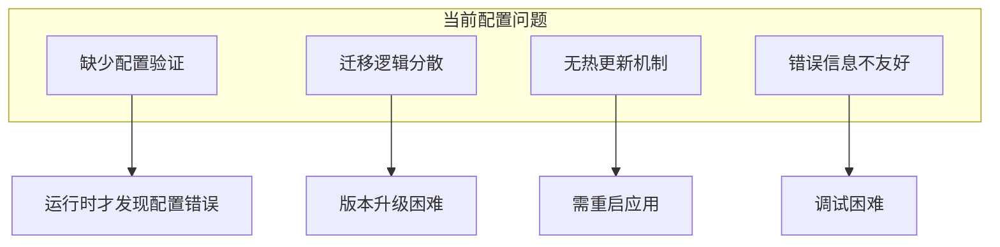
```mermaid
graph TB
    subgraph "当前配置问题"
        C1[缺少配置验证]
        C2[迁移逻辑分散]
        C3[无热更新机制]
        C4[错误信息不友好]
    end
    
    C1 --> D1[运行时才发现配置错误]
    C2 --> D2[版本升级困难]
    C3 --> D3[需重启应用]
    C4 --> D4[调试困难]
```

**具体问题**：

| 问题     | 位置                                  | 影响               |
| ------ | ----------------------------------- | ---------------- |
| 验证不足   | `schema.py` 仅使用 Pydantic 基础验证       | 无法检测逻辑错误（如无效模型名） |
| 迁移逻辑简单 | `loader.py:_migrate_config` 仅处理一个字段 | 未来版本升级困难         |
| 无热更新   | 配置修改需重启应用                           | 运维体验差            |
| 错误信息模糊 | 验证失败时缺少上下文                          | 用户难以定位问题         |

#### 2.2 重构目标架构

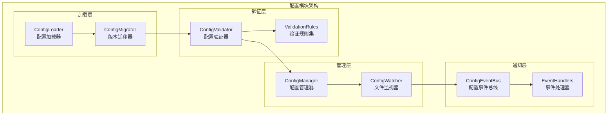
```mermaid
graph TB
    subgraph "配置模块架构"
        subgraph "加载层"
            LOADER[ConfigLoader<br/>配置加载器]
            MIGRATOR[ConfigMigrator<br/>版本迁移器]
        end
        
        subgraph "验证层"
            VALIDATOR[ConfigValidator<br/>配置验证器]
            RULES[ValidationRules<br/>验证规则集]
        end
        
        subgraph "管理层"
            MANAGER[ConfigManager<br/>配置管理器]
            WATCHER[ConfigWatcher<br/>文件监视器]
        end
        
        subgraph "通知层"
            BUS[ConfigEventBus<br/>配置事件总线]
            HANDLERS[EventHandlers<br/>事件处理器]
        end
        
        LOADER --> MIGRATOR
        MIGRATOR --> VALIDATOR
        VALIDATOR --> RULES
        VALIDATOR --> MANAGER
        MANAGER --> WATCHER
        WATCHER --> BUS
        BUS --> HANDLERS
    end
```

#### 2.3 具体重构步骤

**Phase 1: 配置验证器** (3 天)

```python
# horbot/config/validator.py (新文件)

from dataclasses import dataclass
from typing import Any
from enum import Enum

class ValidationSeverity(Enum):
    ERROR = "error"      # 阻止启动
    WARNING = "warning"  # 警告但可继续
    INFO = "info"        # 信息提示

@dataclass
class ValidationResult:
    """验证结果"""
    valid: bool
    errors: list[str]
    warnings: list[str]
    infos: list[str]
    
    @classmethod
    def success(cls) -> "ValidationResult":
        return cls(valid=True, errors=[], warnings=[], infos=[])
    
    def merge(self, other: "ValidationResult") -> "ValidationResult":
        """合并两个验证结果"""
        return ValidationResult(
            valid=self.valid and other.valid,
            errors=self.errors + other.errors,
            warnings=self.warnings + other.warnings,
            infos=self.infos + other.infos,
        )

class ConfigValidator:
    """配置验证器"""
    
    def __init__(self):
        self._rules: list[ValidationRule] = []
        self._register_builtin_rules()
    
    def _register_builtin_rules(self) -> None:
        """注册内置验证规则"""
        self._rules = [
            ProviderKeyRule(),
            ModelNameRule(),
            ChannelConfigRule(),
            WorkspacePathRule(),
            PermissionRule(),
        ]
    
    def validate(self, config: Config) -> ValidationResult:
        """验证配置"""
        result = ValidationResult.success()
        for rule in self._rules:
            rule_result = rule.validate(config)
            result = result.merge(rule_result)
        return result

class ValidationRule(ABC):
    """验证规则基类"""
    
    @property
    @abstractmethod
    def name(self) -> str:
        """规则名称"""
        pass
    
    @abstractmethod
    def validate(self, config: Config) -> ValidationResult:
        """执行验证"""
        pass

class ProviderKeyRule(ValidationRule):
    """验证 Provider API Key 配置"""
    
    @property
    def name(self) -> str:
        return "provider_key"
    
    def validate(self, config: Config) -> ValidationResult:
        errors = []
        warnings = []
        
        # 检查是否有任何 provider 配置了 API key
        has_key = any(
            getattr(config.providers, name, None) and 
            getattr(config.providers, name).api_key
            for name in ["anthropic", "openai", "openrouter", "deepseek"]
        )
        
        if not has_key:
            warnings.append(
                "No API key configured. Set at least one provider's API key."
            )
        
        # 检查 OAuth provider 不应配置 API key
        if config.providers.openai_codex.api_key:
            errors.append(
                "OpenAI Codex uses OAuth, API key should not be set."
            )
        
        return ValidationResult(
            valid=len(errors) == 0,
            errors=errors,
            warnings=warnings,
            infos=[],
        )

class ModelNameRule(ValidationRule):
    """验证模型名称"""
    
    KNOWN_MODELS = {
        "anthropic": ["claude-3-opus", "claude-3-sonnet", "claude-3-haiku", "claude-opus-4-5"],
        "openai": ["gpt-4", "gpt-4-turbo", "gpt-3.5-turbo", "o1", "o3"],
        "deepseek": ["deepseek-chat", "deepseek-reasoner"],
        "gemini": ["gemini-pro", "gemini-1.5-pro"],
    }
    
    @property
    def name(self) -> str:
        return "model_name"
    
    def validate(self, config: Config) -> ValidationResult:
        warnings = []
        model = config.agents.defaults.model
        
        # 检查模型是否已知
        provider = config.get_provider_name(model)
        if provider and provider in self.KNOWN_MODELS:
            known = self.KNOWN_MODELS[provider]
            model_base = model.split("/")[-1] if "/" in model else model
            if not any(m in model_base for m in known):
                warnings.append(
                    f"Model '{model}' may not be recognized by provider '{provider}'. "
                    f"Known models: {', '.join(known)}"
                )
        
        return ValidationResult(
            valid=True,
            errors=[],
            warnings=warnings,
            infos=[],
        )
```

**Phase 2: 配置迁移工具** (2 天)

```python
# horbot/config/migrator.py (新文件)

from dataclasses import dataclass
from typing import Any

@dataclass
class MigrationResult:
    """迁移结果"""
    success: bool
    data: dict[str, Any]
    version_from: str
    version_to: str
    changes: list[str]
    warnings: list[str]

class ConfigMigrator:
    """配置版本迁移器"""
    
    CURRENT_VERSION = "1.1.0"
    
    def __init__(self):
        self._migrations: dict[str, Callable[[dict], dict]] = {}
        self._register_migrations()
    
    def _register_migrations(self) -> None:
        """注册迁移脚本"""
        self._migrations = {
            "1.0.0->1.1.0": self._migrate_1_0_to_1_1,
        }
    
    def migrate(self, data: dict, from_version: str | None = None) -> MigrationResult:
        """执行配置迁移"""
        if from_version is None:
            from_version = data.get("version", "1.0.0")
        
        changes = []
        warnings = []
        current = data
        
        while from_version != self.CURRENT_VERSION:
            migration_key = f"{from_version}->{self._get_next_version(from_version)}"
            if migration_key not in self._migrations:
                warnings.append(f"No migration path from {from_version}")
                break
            
            migration = self._migrations[migration_key]
            current, migration_changes = migration(current)
            changes.extend(migration_changes)
            from_version = self._get_next_version(from_version)
        
        current["version"] = self.CURRENT_VERSION
        
        return MigrationResult(
            success=True,
            data=current,
            version_from=data.get("version", "1.0.0"),
            version_to=self.CURRENT_VERSION,
            changes=changes,
            warnings=warnings,
        )
    
    def _migrate_1_0_to_1_1(self, data: dict) -> tuple[dict, list[str]]:
        """从 1.0.0 迁移到 1.1.0"""
        changes = []
        
        # 迁移: tools.exec.restrictToWorkspace → tools.restrictToWorkspace
        tools = data.get("tools", {})
        exec_cfg = tools.get("exec", {})
        if "restrictToWorkspace" in exec_cfg and "restrictToWorkspace" not in tools:
            tools["restrictToWorkspace"] = exec_cfg.pop("restrictToWorkspace")
            changes.append("Moved tools.exec.restrictToWorkspace to tools.restrictToWorkspace")
        
        # 迁移: 添加新字段默认值
        if "autonomous" not in data:
            data["autonomous"] = {"enabled": False}
            changes.append("Added autonomous config with default values")
        
        return data, changes
```

**Phase 3: 配置热更新机制** (3 天)

```python
# horbot/config/watcher.py (新文件)

import asyncio
from pathlib import Path
from typing import Callable, Any
from dataclasses import dataclass
from enum import Enum

class ConfigChangeEvent(Enum):
    """配置变更事件类型"""
    MODIFIED = "modified"
    RELOADED = "reloaded"
    ERROR = "error"

@dataclass
class ConfigChange:
    """配置变更详情"""
    event: ConfigChangeEvent
    old_config: Config | None
    new_config: Config | None
    changes: dict[str, Any]  # 变更的字段路径
    error: Exception | None = None

class ConfigWatcher:
    """配置文件监视器"""
    
    def __init__(
        self,
        config_path: Path,
        reload_callback: Callable[[ConfigChange], Awaitable[None]],
        poll_interval: float = 1.0,
    ):
        self.config_path = config_path
        self.reload_callback = reload_callback
        self.poll_interval = poll_interval
        self._running = False
        self._last_mtime: float | None = None
        self._current_config: Config | None = None
    
    async def start(self, initial_config: Config) -> None:
        """启动监视器"""
        self._current_config = initial_config
        self._last_mtime = self.config_path.stat().st_mtime
        self._running = True
        
        asyncio.create_task(self._watch_loop())
    
    async def stop(self) -> None:
        """停止监视器"""
        self._running = False
    
    async def _watch_loop(self) -> None:
        """监视循环"""
        while self._running:
            try:
                await asyncio.sleep(self.poll_interval)
                await self._check_changes()
            except asyncio.CancelledError:
                break
            except Exception as e:
                logger.error(f"Config watcher error: {e}")
    
    async def _check_changes(self) -> None:
        """检查配置变更"""
        try:
            current_mtime = self.config_path.stat().st_mtime
            if current_mtime == self._last_mtime:
                return
            
            self._last_mtime = current_mtime
            
            # 加载新配置
            new_config = load_config(self.config_path)
            
            # 计算变更
            changes = self._diff_configs(self._current_config, new_config)
            
            if changes:
                change = ConfigChange(
                    event=ConfigChangeEvent.MODIFIED,
                    old_config=self._current_config,
                    new_config=new_config,
                    changes=changes,
                )
                
                self._current_config = new_config
                
                await self.reload_callback(change)
        
        except Exception as e:
            change = ConfigChange(
                event=ConfigChangeEvent.ERROR,
                old_config=self._current_config,
                new_config=None,
                changes={},
                error=e,
            )
            await self.reload_callback(change)
    
    def _diff_configs(self, old: Config, new: Config) -> dict[str, Any]:
        """比较两个配置的差异"""
        changes = {}
        
        # 比较各字段
        if old.agents.defaults.model != new.agents.defaults.model:
            changes["agents.defaults.model"] = {
                "old": old.agents.defaults.model,
                "new": new.agents.defaults.model,
            }
        
        if old.agents.defaults.temperature != new.agents.defaults.temperature:
            changes["agents.defaults.temperature"] = {
                "old": old.agents.defaults.temperature,
                "new": new.agents.defaults.temperature,
            }
        
        # ... 其他字段比较
        
        return changes

# horbot/config/manager.py (新文件)

class ConfigManager:
    """配置管理器 - 统一配置加载、验证、热更新"""
    
    def __init__(self, config_path: Path | None = None):
        self.config_path = config_path or get_config_path()
        self._config: Config | None = None
        self._validator = ConfigValidator()
        self._migrator = ConfigMigrator()
        self._watcher: ConfigWatcher | None = None
        self._handlers: dict[str, list[Callable]] = {
            "on_change": [],
            "on_error": [],
        }
    
    async def initialize(self) -> Config:
        """初始化配置"""
        # 加载
        data = self._load_raw()
        
        # 迁移
        migration = self._migrator.migrate(data)
        if migration.changes:
            logger.info(f"Config migrated: {migration.changes}")
        
        # 验证
        config = Config.model_validate(migration.data)
        validation = self._validator.validate(config)
        
        if validation.errors:
            raise ConfigValidationError(validation.errors)
        
        for warning in validation.warnings:
            logger.warning(f"Config warning: {warning}")
        
        self._config = config
        
        # 启动热更新监视
        self._watcher = ConfigWatcher(
            self.config_path,
            self._handle_config_change,
        )
        await self._watcher.start(config)
        
        return config
    
    async def _handle_config_change(self, change: ConfigChange) -> None:
        """处理配置变更"""
        if change.event == ConfigChangeEvent.MODIFIED:
            # 验证新配置
            validation = self._validator.validate(change.new_config)
            if validation.errors:
                logger.error(f"Config validation failed: {validation.errors}")
                return
            
            self._config = change.new_config
            
            # 通知处理器
            for handler in self._handlers["on_change"]:
                try:
                    await handler(change)
                except Exception as e:
                    logger.error(f"Config change handler error: {e}")
    
    def on_change(self, handler: Callable) -> None:
        """注册配置变更处理器"""
        self._handlers["on_change"].append(handler)
    
    @property
    def config(self) -> Config:
        """获取当前配置"""
        if self._config is None:
            raise RuntimeError("Config not initialized")
        return self._config
```

#### 2.4 重构后文件结构

```
horbot/config/
├── __init__.py
├── schema.py           # 配置模式定义 (保持)
├── loader.py           # 配置加载 (简化)
├── validator.py        # 配置验证器 (新增)
├── migrator.py         # 版本迁移器 (新增)
├── watcher.py          # 文件监视器 (新增)
├── manager.py          # 配置管理器 (新增)
└── errors.py           # 配置错误类 (新增)
```

***

### 3. 渠道模块重构

**优先级**: 🟡 中\
**依赖**: 无\
**预计工作量**: 1 周

#### 3.1 当前问题分析

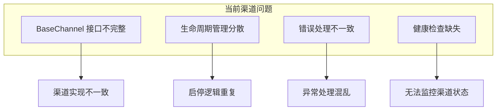
```mermaid
graph TB
    subgraph "当前渠道问题"
        CH1[BaseChannel 接口不完整]
        CH2[生命周期管理分散]
        CH3[错误处理不一致]
        CH4[健康检查缺失]
    end
    
    CH1 --> E1[渠道实现不一致]
    CH2 --> E2[启停逻辑重复]
    CH3 --> E3[异常处理混乱]
    CH4 --> E4[无法监控渠道状态]
```

**具体问题**：

| 问题      | 位置                          | 影响       |
| ------- | --------------------------- | -------- |
| 接口不完整   | `BaseChannel` 缺少健康检查、重连等接口  | 各渠道实现不一致 |
| 生命周期分散  | `ChannelManager` 和各渠道都有启停逻辑 | 代码重复     |
| 错误处理不一致 | 各渠道异常处理方式不同                 | 难以统一处理   |
| 无健康检查   | 无法检测渠道是否正常工作                | 监控困难     |

#### 3.2 重构目标架构

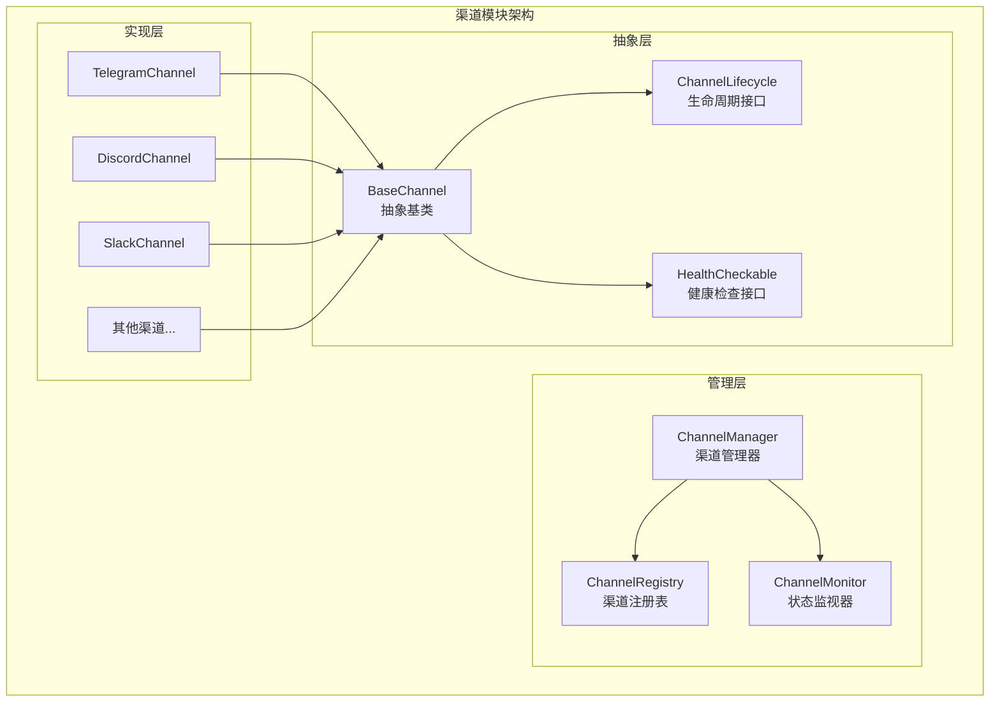
```mermaid
graph TB
    subgraph "渠道模块架构"
        subgraph "抽象层"
            BASE[BaseChannel<br/>抽象基类]
            LIFECYCLE[ChannelLifecycle<br/>生命周期接口]
            HEALTH[HealthCheckable<br/>健康检查接口]
        end
        
        subgraph "管理层"
            MANAGER[ChannelManager<br/>渠道管理器]
            REGISTRY[ChannelRegistry<br/>渠道注册表]
            MONITOR[ChannelMonitor<br/>状态监视器]
        end
        
        subgraph "实现层"
            TG[TelegramChannel]
            DC[DiscordChannel]
            SL[SlackChannel]
            OTHER[其他渠道...]
        end
        
        BASE --> LIFECYCLE
        BASE --> HEALTH
        MANAGER --> REGISTRY
        MANAGER --> MONITOR
        TG --> BASE
        DC --> BASE
        SL --> BASE
        OTHER --> BASE
    end
```

#### 3.3 具体重构步骤

**Phase 1: 增强 BaseChannel 抽象** (2 天)

```python
# horbot/channels/base.py (重构)

from abc import ABC, abstractmethod
from dataclasses import dataclass
from enum import Enum
from typing import Any, Callable

class ChannelState(Enum):
    """渠道状态"""
    STOPPED = "stopped"
    STARTING = "starting"
    RUNNING = "running"
    STOPPING = "stopping"
    ERROR = "error"
    RECONNECTING = "reconnecting"

@dataclass
class ChannelHealth:
    """渠道健康状态"""
    healthy: bool
    latency_ms: float | None
    last_message_at: datetime | None
    error_count: int
    last_error: str | None
    metadata: dict[str, Any]

@dataclass
class ChannelMetrics:
    """渠道指标"""
    messages_received: int = 0
    messages_sent: int = 0
    errors: int = 0
    reconnects: int = 0
    uptime_seconds: float = 0

class BaseChannel(ABC):
    """
    增强的渠道抽象基类
    
    提供统一的生命周期管理、健康检查和指标收集。
    """
    
    name: str = "base"
    
    def __init__(self, config: Any, bus: MessageBus):
        self.config = config
        self.bus = bus
        self._state = ChannelState.STOPPED
        self._metrics = ChannelMetrics()
        self._health = ChannelHealth(
            healthy=False,
            latency_ms=None,
            last_message_at=None,
            error_count=0,
            last_error=None,
            metadata={},
        )
        self._start_time: datetime | None = None
        self._state_handlers: list[Callable[[ChannelState], Awaitable[None]]] = []
    
    # === 生命周期方法 ===
    
    async def start(self) -> None:
        """启动渠道（模板方法）"""
        if self._state != ChannelState.STOPPED:
            return
        
        self._set_state(ChannelState.STARTING)
        try:
            await self._do_start()
            self._start_time = datetime.now()
            self._set_state(ChannelState.RUNNING)
        except Exception as e:
            self._health.last_error = str(e)
            self._health.error_count += 1
            self._set_state(ChannelState.ERROR)
            raise
    
    async def stop(self) -> None:
        """停止渠道（模板方法）"""
        if self._state == ChannelState.STOPPED:
            return
        
        self._set_state(ChannelState.STOPPING)
        try:
            await self._do_stop()
        finally:
            self._start_time = None
            self._set_state(ChannelState.STOPPED)
    
    async def restart(self) -> None:
        """重启渠道"""
        await self.stop()
        await self.start()
    
    @abstractmethod
    async def _do_start(self) -> None:
        """子类实现的启动逻辑"""
        pass
    
    @abstractmethod
    async def _do_stop(self) -> None:
        """子类实现的停止逻辑"""
        pass
    
    # === 消息发送 ===
    
    @abstractmethod
    async def send(self, msg: OutboundMessage) -> None:
        """发送消息"""
        pass
    
    async def send_with_retry(
        self,
        msg: OutboundMessage,
        max_retries: int = 3,
        retry_delay: float = 1.0,
    ) -> bool:
        """带重试的消息发送"""
        for attempt in range(max_retries):
            try:
                await self.send(msg)
                self._metrics.messages_sent += 1
                return True
            except Exception as e:
                self._health.last_error = str(e)
                if attempt < max_retries - 1:
                    await asyncio.sleep(retry_delay * (attempt + 1))
        return False
    
    # === 健康检查 ===
    
    async def health_check(self) -> ChannelHealth:
        """执行健康检查"""
        try:
            health = await self._do_health_check()
            self._health = health
            return health
        except Exception as e:
            self._health.healthy = False
            self._health.last_error = str(e)
            return self._health
    
    async def _do_health_check(self) -> ChannelHealth:
        """子类实现的健康检查逻辑（可选）"""
        return ChannelHealth(
            healthy=self._state == ChannelState.RUNNING,
            latency_ms=None,
            last_message_at=None,
            error_count=self._health.error_count,
            last_error=self._health.last_error,
            metadata={},
        )
    
    # === 状态管理 ===
    
    @property
    def state(self) -> ChannelState:
        """获取当前状态"""
        return self._state
    
    @property
    def is_running(self) -> bool:
        """检查是否运行中"""
        return self._state == ChannelState.RUNNING
    
    @property
    def metrics(self) -> ChannelMetrics:
        """获取指标"""
        if self._start_time:
            self._metrics.uptime_seconds = (datetime.now() - self._start_time).total_seconds()
        return self._metrics
    
    def on_state_change(self, handler: Callable[[ChannelState], Awaitable[None]]) -> None:
        """注册状态变更处理器"""
        self._state_handlers.append(handler)
    
    def _set_state(self, state: ChannelState) -> None:
        """设置状态并通知处理器"""
        old_state = self._state
        self._state = state
        if old_state != state:
            for handler in self._state_handlers:
                asyncio.create_task(handler(state))
    
    # === 权限检查 ===
    
    def is_allowed(self, sender_id: str) -> bool:
        """检查发送者权限"""
        allow_list = getattr(self.config, "allow_from", [])
        if not allow_list:
            return True
        sender_str = str(sender_id)
        if sender_str in allow_list:
            return True
        if "|" in sender_str:
            for part in sender_str.split("|"):
                if part and part in allow_list:
                    return True
        return False
    
    # === 消息处理 ===
    
    async def _handle_message(
        self,
        sender_id: str,
        chat_id: str,
        content: str,
        media: list[str] | None = None,
        metadata: dict[str, Any] | None = None,
        session_key: str | None = None,
    ) -> None:
        """处理入站消息"""
        if not self.is_allowed(sender_id):
            logger.warning(f"Access denied for {sender_id} on {self.name}")
            return
        
        self._metrics.messages_received += 1
        self._health.last_message_at = datetime.now()
        
        msg = InboundMessage(
            channel=self.name,
            sender_id=str(sender_id),
            chat_id=str(chat_id),
            content=content,
            media=media or [],
            metadata=metadata or {},
            session_key_override=session_key,
        )
        
        await self.bus.publish_inbound(msg)
```

**Phase 2: 渠道监视器** (2 天)

```python
# horbot/channels/monitor.py (新文件)

class ChannelMonitor:
    """渠道状态监视器"""
    
    def __init__(
        self,
        check_interval: float = 60.0,
        unhealthy_threshold: int = 3,
    ):
        self.check_interval = check_interval
        self.unhealthy_threshold = unhealthy_threshold
        self._channels: dict[str, BaseChannel] = {}
        self._health_status: dict[str, ChannelHealth] = {}
        self._consecutive_failures: dict[str, int] = {}
        self._running = False
    
    def register(self, channel: BaseChannel) -> None:
        """注册渠道"""
        self._channels[channel.name] = channel
        channel.on_state_change(self._handle_state_change)
    
    async def start(self) -> None:
        """启动监视器"""
        self._running = True
        asyncio.create_task(self._monitor_loop())
    
    async def stop(self) -> None:
        """停止监视器"""
        self._running = False
    
    async def _monitor_loop(self) -> None:
        """监视循环"""
        while self._running:
            try:
                await self._check_all()
                await asyncio.sleep(self.check_interval)
            except asyncio.CancelledError:
                break
            except Exception as e:
                logger.error(f"Monitor error: {e}")
    
    async def _check_all(self) -> None:
        """检查所有渠道"""
        for name, channel in self._channels.items():
            if channel.state != ChannelState.RUNNING:
                continue
            
            health = await channel.health_check()
            self._health_status[name] = health
            
            if not health.healthy:
                self._consecutive_failures[name] = self._consecutive_failures.get(name, 0) + 1
                
                if self._consecutive_failures[name] >= self.unhealthy_threshold:
                    logger.warning(f"Channel {name} is unhealthy, attempting restart")
                    await self._restart_channel(name)
            else:
                self._consecutive_failures[name] = 0
    
    async def _restart_channel(self, name: str) -> None:
        """重启不健康的渠道"""
        channel = self._channels.get(name)
        if not channel:
            return
        
        try:
            await channel.restart()
            logger.info(f"Channel {name} restarted successfully")
        except Exception as e:
            logger.error(f"Failed to restart channel {name}: {e}")
    
    async def _handle_state_change(self, state: ChannelState) -> None:
        """处理渠道状态变更"""
        if state == ChannelState.ERROR:
            # 触发告警
            logger.warning(f"Channel entered error state")
    
    def get_status(self) -> dict[str, Any]:
        """获取所有渠道状态"""
        return {
            name: {
                "state": channel.state.value,
                "healthy": self._health_status.get(name, ChannelHealth(healthy=False)).healthy,
                "metrics": channel.metrics.__dict__,
            }
            for name, channel in self._channels.items()
        }
```

#### 3.4 重构后文件结构

```
horbot/channels/
├── __init__.py
├── base.py             # 增强的 BaseChannel (重构)
├── manager.py          # ChannelManager (简化)
├── monitor.py          # ChannelMonitor (新增)
├── registry.py         # ChannelRegistry (新增)
├── telegram.py         # Telegram 渠道 (适配新接口)
├── discord.py          # Discord 渠道 (适配新接口)
├── slack.py            # Slack 渠道 (适配新接口)
├── feishu.py           # 飞书渠道 (适配新接口)
├── dingtalk.py         # 钉钉渠道 (适配新接口)
├── qq.py               # QQ 渠道 (适配新接口)
├── email.py            # 邮件渠道 (适配新接口)
├── whatsapp.py         # WhatsApp 渠道 (适配新接口)
├── matrix.py           # Matrix 渠道 (适配新接口)
└── mochat.py           # Mochat 渠道 (适配新接口)
```

***

### 4. Provider 模块重构

**优先级**: 🟡 中\
**依赖**: 无\
**预计工作量**: 1 周

#### 4.1 当前问题分析

```mermaid
graph TB
    subgraph "当前 Provider 问题"
        P1[缺少重试机制]
        P2[无降级策略]
        P3[错误处理不统一]
        P4[指标收集缺失]
    end
    
    P1 --> F1[网络波动导致失败]
    P2 --> F2[单点故障]
    P3 --> F3[异常信息丢失]
    P4 --> F4[无法监控性能]
```

**具体问题**：

| 问题      | 位置                          | 影响       |
| ------- | --------------------------- | -------- |
| 无重试机制   | `LiteLLMProvider.chat` 直接调用 | 网络波动导致失败 |
| 无降级策略   | Provider 失败后无备选             | 单点故障     |
| 错误处理不统一 | 各 Provider 异常处理不同           | 难以统一处理   |
| 无指标收集   | 缺少延迟、token 使用等指标            | 无法监控性能   |

#### 4.2 重构目标架构

```mermaid
graph TB
    subgraph "Provider 模块架构"
        subgraph "抽象层"
            BASE[BaseProvider<br/>抽象基类]
            RETRY[RetryPolicy<br/>重试策略]
            FALLBACK[FallbackPolicy<br/>降级策略]
        end
        
        subgraph "管理层"
            REGISTRY[ProviderRegistry<br/>提供商注册表]
            SELECTOR[ProviderSelector<br/>提供商选择器]
            MONITOR[ProviderMonitor<br/>性能监视器]
        end
        
        subgraph "实现层"
            LITELLM[LiteLLMProvider]
            CODEX[OpenAICodexProvider]
            CUSTOM[CustomProvider]
        end
        
        BASE --> RETRY
        BASE --> FALLBACK
        REGISTRY --> SELECTOR
        SELECTOR --> MONITOR
        LITELLM --> BASE
        CODEX --> BASE
        CUSTOM --> BASE
    end
```

#### 4.3 具体重构步骤

**Phase 1: 增强 BaseProvider 抽象** (2 天)

```python
# horbot/providers/base.py (重构)

from abc import ABC, abstractmethod
from dataclasses import dataclass, field
from typing import Any
from enum import Enum

class ProviderState(Enum):
    """Provider 状态"""
    HEALTHY = "healthy"
    DEGRADED = "degraded"
    UNHEALTHY = "unhealthy"

@dataclass
class ProviderMetrics:
    """Provider 指标"""
    total_requests: int = 0
    successful_requests: int = 0
    failed_requests: int = 0
    total_tokens: int = 0
    total_latency_ms: float = 0
    last_request_at: datetime | None = None
    last_error: str | None = None
    consecutive_failures: int = 0
    
    @property
    def success_rate(self) -> float:
        if self.total_requests == 0:
            return 1.0
        return self.successful_requests / self.total_requests
    
    @property
    def avg_latency_ms(self) -> float:
        if self.successful_requests == 0:
            return 0
        return self.total_latency_ms / self.successful_requests

@dataclass
class RetryConfig:
    """重试配置"""
    max_retries: int = 3
    base_delay: float = 1.0
    max_delay: float = 30.0
    exponential_base: float = 2.0
    retryable_errors: tuple[str, ...] = (
        "rate_limit",
        "timeout",
        "connection_error",
        "server_error",
    )

@dataclass
class ProviderConfig:
    """Provider 配置"""
    api_key: str | None = None
    api_base: str | None = None
    default_model: str | None = None
    extra_headers: dict[str, str] | None = None
    retry: RetryConfig = field(default_factory=RetryConfig)
    timeout: float = 60.0

class LLMProvider(ABC):
    """
    增强的 LLM Provider 抽象基类
    
    提供统一的重试机制、指标收集和健康检查。
    """
    
    def __init__(self, config: ProviderConfig):
        self.config = config
        self._metrics = ProviderMetrics()
        self._state = ProviderState.HEALTHY
    
    # === 核心方法 ===
    
    @abstractmethod
    async def _do_chat(
        self,
        messages: list[dict[str, Any]],
        tools: list[dict[str, Any]] | None,
        model: str | None,
        max_tokens: int,
        temperature: float,
    ) -> LLMResponse:
        """子类实现的实际请求逻辑"""
        pass
    
    async def chat(
        self,
        messages: list[dict[str, Any]],
        tools: list[dict[str, Any]] | None = None,
        model: str | None = None,
        max_tokens: int = 4096,
        temperature: float = 0.7,
    ) -> LLMResponse:
        """
        发送聊天请求（带重试和指标收集）
        """
        messages = self._sanitize_empty_content(messages)
        
        for attempt in range(self.config.retry.max_retries + 1):
            try:
                start_time = time.time()
                
                response = await self._do_chat(
                    messages=messages,
                    tools=tools,
                    model=model or self.config.default_model,
                    max_tokens=max_tokens,
                    temperature=temperature,
                )
                
                # 更新指标
                latency_ms = (time.time() - start_time) * 1000
                self._record_success(response, latency_ms)
                
                return response
                
            except Exception as e:
                error_type = self._classify_error(e)
                
                if error_type in self.config.retry.retryable_errors:
                    if attempt < self.config.retry.max_retries:
                        delay = self._calculate_delay(attempt)
                        logger.warning(
                            f"Provider request failed (attempt {attempt + 1}), "
                            f"retrying in {delay:.1f}s: {e}"
                        )
                        await asyncio.sleep(delay)
                        continue
                
                self._record_failure(e)
                raise
    
    def _calculate_delay(self, attempt: int) -> float:
        """计算重试延迟（指数退避）"""
        delay = self.config.retry.base_delay * (
            self.config.retry.exponential_base ** attempt
        )
        return min(delay, self.config.retry.max_delay)
    
    def _classify_error(self, error: Exception) -> str:
        """分类错误类型"""
        error_str = str(error).lower()
        
        if "rate limit" in error_str or "429" in error_str:
            return "rate_limit"
        if "timeout" in error_str:
            return "timeout"
        if "connection" in error_str or "network" in error_str:
            return "connection_error"
        if "500" in error_str or "502" in error_str or "503" in error_str:
            return "server_error"
        
        return "unknown"
    
    # === 指标和状态 ===
    
    def _record_success(self, response: LLMResponse, latency_ms: float) -> None:
        """记录成功请求"""
        self._metrics.total_requests += 1
        self._metrics.successful_requests += 1
        self._metrics.total_latency_ms += latency_ms
        self._metrics.last_request_at = datetime.now()
        self._metrics.consecutive_failures = 0
        
        if response.usage:
            self._metrics.total_tokens += response.usage.get("total_tokens", 0)
        
        # 更新状态
        if self._state == ProviderState.UNHEALTHY:
            self._state = ProviderState.DEGRADED
        elif self._state == ProviderState.DEGRADED:
            if self._metrics.success_rate > 0.9:
                self._state = ProviderState.HEALTHY
    
    def _record_failure(self, error: Exception) -> None:
        """记录失败请求"""
        self._metrics.total_requests += 1
        self._metrics.failed_requests += 1
        self._metrics.last_error = str(error)
        self._metrics.last_request_at = datetime.now()
        self._metrics.consecutive_failures += 1
        
        # 更新状态
        if self._metrics.consecutive_failures >= 3:
            self._state = ProviderState.UNHEALTHY
        elif self._metrics.consecutive_failures >= 1:
            self._state = ProviderState.DEGRADED
    
    @property
    def metrics(self) -> ProviderMetrics:
        """获取指标"""
        return self._metrics
    
    @property
    def state(self) -> ProviderState:
        """获取状态"""
        return self._state
    
    @property
    def is_healthy(self) -> bool:
        """检查是否健康"""
        return self._state != ProviderState.UNHEALTHY
    
    # === 其他方法 ===
    
    @staticmethod
    def _sanitize_empty_content(messages: list[dict[str, Any]]) -> list[dict[str, Any]]:
        """清理空内容"""
        # ... 保持原有实现
        pass
    
    @abstractmethod
    def get_default_model(self) -> str:
        """获取默认模型"""
        pass
```

**Phase 2: Provider 选择器和降级策略** (2 天)

```python
# horbot/providers/selector.py (新文件)

from dataclasses import dataclass
from typing import Any

@dataclass
class FallbackConfig:
    """降级配置"""
    enabled: bool = True
    max_fallbacks: int = 3
    skip_unhealthy: bool = True
    prefer_same_provider: bool = False

class ProviderSelector:
    """
    Provider 选择器
    
    负责选择最佳 Provider 并处理降级。
    """
    
    def __init__(
        self,
        registry: "ProviderRegistry",
        fallback_config: FallbackConfig | None = None,
    ):
        self.registry = registry
        self.fallback_config = fallback_config or FallbackConfig()
        self._fallback_history: dict[str, list[str]] = {}
    
    def select(
        self,
        model: str,
        preferred_provider: str | None = None,
    ) -> tuple[LLMProvider, str]:
        """
        选择最佳 Provider
        
        Returns:
            (provider, normalized_model)
        """
        # 1. 如果指定了 provider，优先使用
        if preferred_provider:
            provider = self.registry.get(preferred_provider)
            if provider and provider.is_healthy:
                return provider, model
        
        # 2. 根据模型匹配 provider
        spec = find_by_model(model) or find_gateway(
            api_key=self.registry.get_api_key(model),
            api_base=self.registry.get_api_base(model),
        )
        
        if spec:
            provider = self.registry.get(spec.name)
            if provider and (provider.is_healthy or not self.fallback_config.skip_unhealthy):
                return provider, self._normalize_model(model, spec)
        
        # 3. 降级到第一个可用的健康 provider
        if self.fallback_config.enabled:
            for name, provider in self.registry.all():
                if provider.is_healthy:
                    logger.warning(f"Falling back to provider: {name}")
                    return provider, model
        
        raise NoHealthyProviderError("No healthy provider available")
    
    def select_fallback(
        self,
        failed_provider: str,
        model: str,
    ) -> LLMProvider | None:
        """选择降级 Provider"""
        if not self.fallback_config.enabled:
            return None
        
        history = self._fallback_history.setdefault(failed_provider, [])
        
        for name, provider in self.registry.all():
            if name == failed_provider:
                continue
            if name in history:
                continue
            if not provider.is_healthy and self.fallback_config.skip_unhealthy:
                continue
            
            history.append(name)
            if len(history) > self.fallback_config.max_fallbacks:
                history.pop(0)
            
            logger.info(f"Fallback from {failed_provider} to {name}")
            return provider
        
        return None
    
    def _normalize_model(self, model: str, spec: ProviderSpec) -> str:
        """规范化模型名称"""
        if spec.litellm_prefix and not model.startswith(spec.litellm_prefix):
            if not any(model.startswith(p) for p in spec.skip_prefixes):
                return f"{spec.litellm_prefix}/{model}"
        return model

# horbot/providers/registry.py (重构)

class ProviderRegistry:
    """
    Provider 注册表
    
    管理所有可用的 Provider 实例。
    """
    
    def __init__(self, config: Config):
        self.config = config
        self._providers: dict[str, LLMProvider] = {}
        self._initialize_providers()
    
    def _initialize_providers(self) -> None:
        """初始化所有配置的 Provider"""
        for spec in PROVIDERS:
            provider_config = getattr(self.config.providers, spec.name, None)
            if not provider_config:
                continue
            
            if spec.is_oauth or provider_config.api_key:
                provider = create_provider(
                    provider_name=spec.name,
                    api_key=provider_config.api_key,
                    api_base=provider_config.api_base,
                    extra_headers=provider_config.extra_headers,
                    default_model=self.config.agents.defaults.model,
                )
                self._providers[spec.name] = provider
    
    def get(self, name: str) -> LLMProvider | None:
        """获取 Provider"""
        return self._providers.get(name)
    
    def all(self) -> Iterator[tuple[str, LLMProvider]]:
        """遍历所有 Provider"""
        for name, provider in self._providers.items():
            yield name, provider
    
    def get_healthy(self) -> list[tuple[str, LLMProvider]]:
        """获取所有健康的 Provider"""
        return [
            (name, provider)
            for name, provider in self._providers.items()
            if provider.is_healthy
        ]
    
    def get_status(self) -> dict[str, Any]:
        """获取所有 Provider 状态"""
        return {
            name: {
                "state": provider.state.value,
                "healthy": provider.is_healthy,
                "metrics": {
                    "total_requests": provider.metrics.total_requests,
                    "success_rate": provider.metrics.success_rate,
                    "avg_latency_ms": provider.metrics.avg_latency_ms,
                    "total_tokens": provider.metrics.total_tokens,
                },
            }
            for name, provider in self._providers.items()
        }
```

**Phase 3: Provider 监视器** (1 天)

```python
# horbot/providers/monitor.py (新文件)

class ProviderMonitor:
    """Provider 性能监视器"""
    
    def __init__(
        self,
        registry: ProviderRegistry,
        check_interval: float = 30.0,
    ):
        self.registry = registry
        self.check_interval = check_interval
        self._running = False
        self._alert_handlers: list[Callable[[str, str], Awaitable[None]]] = []
    
    async def start(self) -> None:
        """启动监视器"""
        self._running = True
        asyncio.create_task(self._monitor_loop())
    
    async def stop(self) -> None:
        """停止监视器"""
        self._running = False
    
    def on_alert(self, handler: Callable[[str, str], Awaitable[None]]) -> None:
        """注册告警处理器"""
        self._alert_handlers.append(handler)
    
    async def _monitor_loop(self) -> None:
        """监视循环"""
        while self._running:
            try:
                await self._check_all()
                await asyncio.sleep(self.check_interval)
            except asyncio.CancelledError:
                break
            except Exception as e:
                logger.error(f"Provider monitor error: {e}")
    
    async def _check_all(self) -> None:
        """检查所有 Provider"""
        for name, provider in self.registry.all():
            metrics = provider.metrics
            
            # 检查成功率
            if metrics.total_requests > 10 and metrics.success_rate < 0.8:
                await self._alert(
                    name,
                    f"Low success rate: {metrics.success_rate:.1%}"
                )
            
            # 检查延迟
            if metrics.avg_latency_ms > 10000:
                await self._alert(
                    name,
                    f"High latency: {metrics.avg_latency_ms:.0f}ms"
                )
            
            # 检查状态
            if provider.state == ProviderState.UNHEALTHY:
                await self._alert(
                    name,
                    f"Provider is unhealthy: {metrics.last_error}"
                )
    
    async def _alert(self, provider: str, message: str) -> None:
        """发送告警"""
        logger.warning(f"Provider alert [{provider}]: {message}")
        for handler in self._alert_handlers:
            try:
                await handler(provider, message)
            except Exception as e:
                logger.error(f"Alert handler error: {e}")
```

#### 4.4 重构后文件结构

```
horbot/providers/
├── __init__.py
├── base.py             # 增强的 BaseProvider (重构)
├── registry.py         # ProviderRegistry (重构)
├── selector.py         # ProviderSelector (新增)
├── monitor.py          # ProviderMonitor (新增)
├── litellm_provider.py # LiteLLM 适配 (适配新接口)
├── openai_codex_provider.py # OpenAI Codex (适配新接口)
├── custom_provider.py  # 自定义 Provider (适配新接口)
└── transcription.py    # 语音转录 (保持)
```

***

### 5. 重构实施计划

#### 5.1 总体时间线

```mermaid
gantt
    title horbot 重构时间线
    dateFormat  YYYY-MM-DD
    section Agent 模块
    Phase 1-消息处理器     :a1, 2024-01-01, 3d
    Phase 2-工具执行器     :a2, after a1, 2d
    Phase 3-回调接口       :a3, after a2, 2d
    Phase 4-依赖注入       :a4, after a3, 3d
    Phase 5-状态管理       :a5, after a4, 2d
    section 配置模块
    Phase 1-验证器         :c1, 2024-01-01, 3d
    Phase 2-迁移工具       :c2, after c1, 2d
    Phase 3-热更新         :c3, after c2, 3d
    section 渠道模块
    Phase 1-BaseChannel    :ch1, 2024-01-08, 2d
    Phase 2-监视器         :ch2, after ch1, 2d
    section Provider 模块
    Phase 1-BaseProvider   :p1, 2024-01-08, 2d
    Phase 2-选择器         :p2, after p1, 2d
    Phase 3-监视器         :p3, after p2, 1d
```

#### 5.2 优先级矩阵

| 模块       | 优先级  | 影响范围 | 风险 | 建议顺序            |
| -------- | ---- | ---- | -- | --------------- |
| Agent    | 🔴 高 | 核心   | 中  | 1               |
| 配置       | 🔴 高 | 全局   | 低  | 2 (可与 Agent 并行) |
| 渠道       | 🟡 中 | 外围   | 低  | 3               |
| Provider | 🟡 中 | 核心   | 中  | 4               |

#### 5.3 依赖关系

```mermaid
graph LR
    A[配置模块] --> B[Agent 模块]
    A --> C[Provider 模块]
    A --> D[渠道模块]
    B --> C
    D --> B
```

#### 5.4 风险缓解

| 风险     | 缓解措施                 |
| ------ | -------------------- |
| 破坏现有功能 | 每个 Phase 前补充测试，后验证通过 |
| 性能退化   | 基准测试对比，关键路径避免过度抽象    |
| 兼容性问题  | 保持旧接口，新接口并行存在        |
| 文档滞后   | 代码变更同步更新架构文档         |

***

### 6. 验收标准

#### 6.1 Agent 模块

- [ ] `loop.py` 行数 < 400
- [ ] 单元测试覆盖率 > 80%
- [ ] 所有回调通过 `CallbackBus` 传递
- [ ] 支持依赖注入，可模拟所有外部依赖

#### 6.2 配置模块

- [ ] 配置错误在启动时检测并给出清晰提示
- [ ] 支持从 v1.0.0 迁移到当前版本
- [ ] 配置修改后自动生效（热更新）
- [ ] 验证警告信息友好可操作

#### 6.3 渠道模块

- [ ] 所有渠道实现统一的 `BaseChannel` 接口
- [ ] 支持健康检查和自动重启
- [ ] 渠道状态可通过 API 查询
- [ ] 错误处理统一，日志完整

#### 6.4 Provider 模块

- [ ] 支持自动重试（指数退避）
- [ ] 支持 Provider 降级
- [ ] 性能指标可通过 API 查询
- [ ] 异常分类清晰可处理
