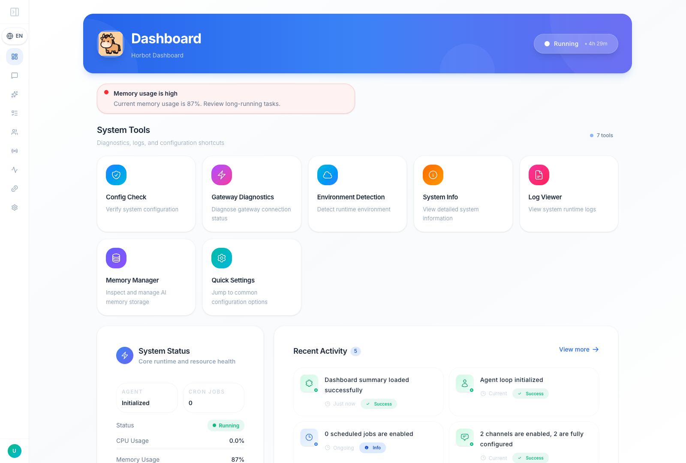
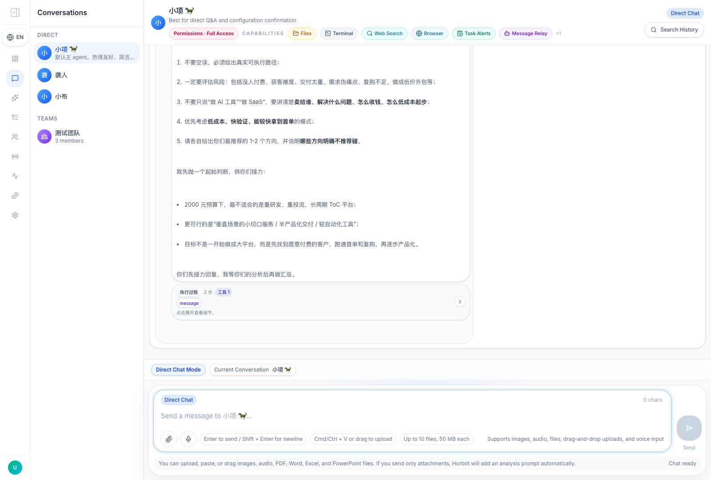
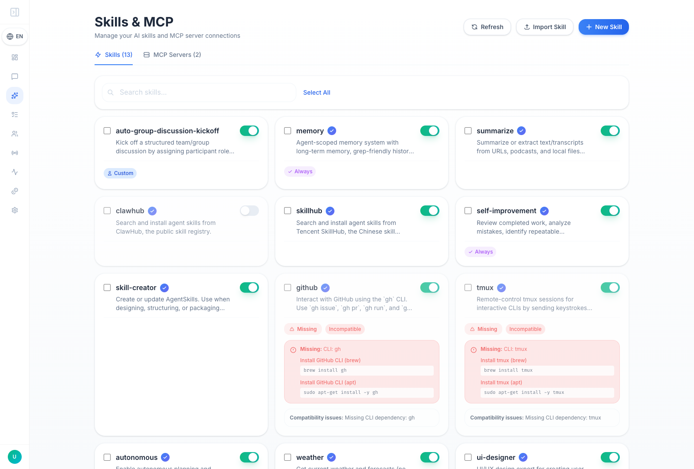
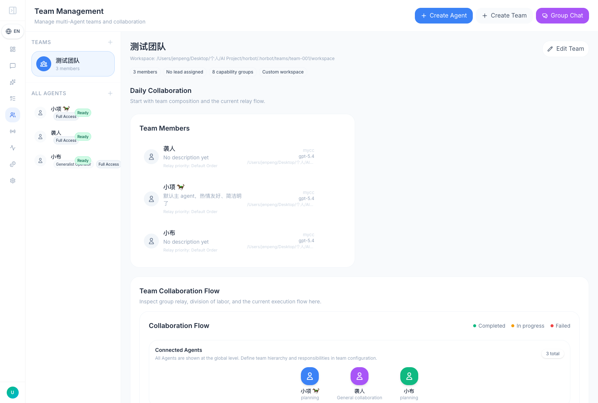

# Horbot Documentation

This is the English documentation hub for Horbot.

- [Project Home](../README.md)
- [简体中文](./README_CN.md)

## Overview

Horbot is a lightweight multi-agent assistant stack with:

- per-agent workspace, memory, sessions, and skills
- Web UI for operations and configuration
- browser-persisted UI locale switching for English, Simplified Chinese, and Thai
- chat, attachments, and relay-style team conversations
- chat-side Live Artifacts for temporary interactive dashboards, charts, maps, process views, and reports
- high-fidelity PPTX previews through LibreOffice PDF export and lazy per-slide PNG rendering
- compact chat layout plus baton-aware relay status in team conversations
- no-store chat history reloads plus incremental fallback recovery so the latest turns remain visible after refreshes and module switches
- automatic DM -> team -> DM baton navigation in Web Chat, with a temporary top banner so relay-driven view changes are explicit
- promoted remote image links that render as normal image-card attachments, plus a manual remote-image cache clear entry in Configuration
- MCP and external channel integration
- External Agent inbound-bot adapters for Feishu/Discord-style vendor or local agent platforms, plus compatibility adapters for OpenAI-compatible and generic HTTP/SSE/WebSocket services
- Channels-managed Horbot inbound bot endpoints that provide App ID, Token, and an Inbound URL for platforms such as WorkBuddy to push messages into a fixed or request-specified internal Agent
- Playwright-backed browser tooling with `browser`, `web_search`, and `web_fetch` as the standard web tool path
- background skill distillation from reusable work into skill families plus `references/` notes
- validated `.skill` / `.zip` imports with compatibility checks
- Skills UI actions for consolidating auto-generated skills, promoting custom skills into built-in system skills, and inspecting a focused skill graph
- agent-scoped skill graphs that link skills, reference files, and related capabilities, then provide compact runtime hints without loading full reference content
- WeCom AI Bot channel support with reply streaming and media handling

## Interface Preview

The images below are captured from the current Horbot Web UI with the interface language set to English.

| Dashboard | Chat |
| --- | --- |
|  |  |

| Skills | Teams |
| --- | --- |
|  |  |

## Guides

- [Architecture](./ARCHITECTURE.md)
- [API](./API.md)
- [User Manual](./USER_MANUAL.md)
- [Multi-Agent Guide](./MULTI_AGENT_GUIDE.md)
- [Skills](./SKILLS.md)
- [Security](./SECURITY.md)
- [Contributing](./CONTRIBUTING.md)
- [Changelog](../CHANGELOG.md)

## Runtime Notes

The active runtime model is agent-scoped:

- `.horbot/agents/<agent-id>/workspace`
- `.horbot/agents/<agent-id>/workspace/.horbot-agent/memory`
- `.horbot/agents/<agent-id>/workspace/.horbot-agent/sessions`
- `.horbot/agents/<agent-id>/workspace/.horbot-agent/skills`

Legacy `.horbot/context` and `.horbot/memory` directories are no longer used by the current memory pipeline.

Legacy agent-owned top-level directories such as `.horbot/agents/<agent-id>/{memory,sessions,skills}` are migration-only and should not be reintroduced.

Creating an agent in the current UI requires choosing both `provider` and `model` up front.

Recent chat updates also tightened assistant message spacing, improved Markdown density, and surfaced clearer relay baton state for multi-agent team discussions.

Current web runtime notes:

- `browser` MCP now defaults to Playwright instead of a built-in `web-access` proxy
- `./horbot.sh start` only starts the normal Horbot services: backend, frontend, and gateway
- the agent now uses `browser`, `web_search`, and `web_fetch` as the standard web/search tools
- `./horbot.sh install` now also bootstraps `OfficeCLI`, injects a default `officecli mcp` server into `.horbot/config.json`, and appends the detected OfficeCLI bin directory to `tools.exec.pathAppend`
- `./horbot.sh install officecli` can be used to install or refresh only the OfficeCLI dependency and default MCP wiring
- `./horbot.sh install libreoffice` installs LibreOffice for PPTX preview; `./horbot.sh check libreoffice` verifies the detected `soffice` command
- `./horbot.sh smoke officecli` validates direct `officecli` document operations for `.docx`, `.xlsx`, and `.pptx`
- Configuration now exposes a remote-image cache status panel and manual clear action for chat image-card materialization
- Backend Web API routes are organized in focused `horbot/web/*_routes.py` modules. New feature APIs should go into the closest route module instead of expanding `horbot/web/api.py`.
